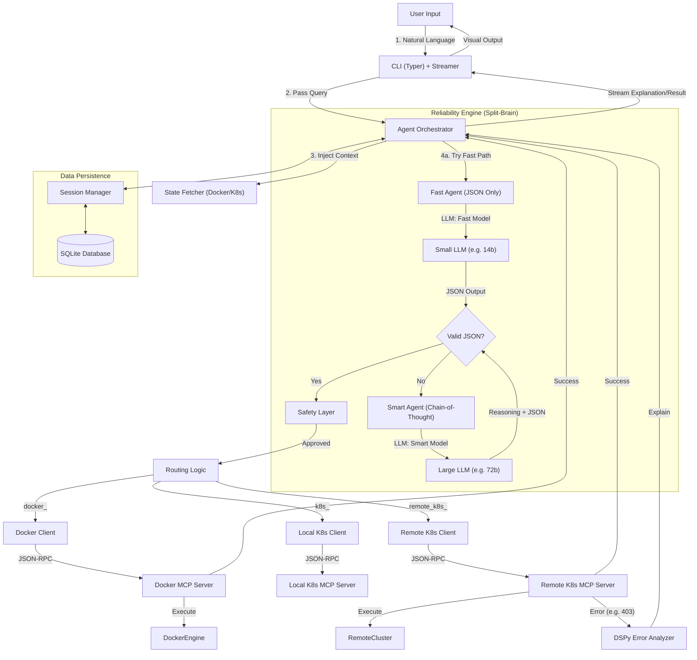

# Architecture and Developer Guide

This document provides a comprehensive overview of the DevOps Agent architecture, explaining how the components interact, the lifecycle of a command, and the technical decisions behind the system.

## 1. Introduction

DevOps Agent is an AI-powered CLI tool that allows users to manage Docker and Kubernetes resources using natural language. Unlike simple "text-to-command" wrappers, it uses an agentic architecture (planning, reasoning, verification) to ensure safety and reliability.

The system is designed to be:
- **Private:** Uses local LLMs (Ollama) by default.
- **Safe:** Implements a safety layer with user confirmation for destructive actions.
- **Extensible:** Built on the Model Context Protocol (MCP) to easily add new capabilities.

## 2. System Overview

The system consists of three main layers:

1.  **User Interface (CLI):** A Typer-based CLI that handles input, rendering, and session management.
2.  **Orchestration Layer (Agent):** A Python-based agent (using DSPy) that reasons about user intent, selects tools, and validates actions.
3.  **Execution Layer (MCP Servers):** Three independent servers (Docker, Local K8s, Remote K8s) that expose functionality via JSON-RPC.

## 3. Core Technologies

- **Python 3.9+:** The core language.
- **Typer:** For building the CLI.
- **DSPy:** For declarative and robust LLM orchestration (replacing brittle prompt engineering).
- **Ollama:** For running local or remote LLMs (e.g., Llama 3.2, Qwen 2.5).
- **Model Context Protocol (MCP):** A standard protocol for connecting AI agents to external systems.
- **Pydantic:** For data validation and schema generation.

---

## 4. Architecture Diagram



---

## 5. The Lifecycle of a Command

Let's trace exactly what happens when you run a command.

### Scenario: "Describe pod nginx-123"

#### Step 1: Initialization (Interactive)
Before you run a query, you execute `devops-agent start-all`.
- **Interaction:** The CLI prompts you to select:
    1. **Host:** Local vs Remote/HPC.
    2. **Model:** "Hot Swap" selection of available models (e.g., `qwen2.5:72b` or `llama3.2`).
- **Triggers:** `cli.py` spawns 3 separate subprocesses with the selected configuration.
- **Process 1:** Starts `server.py` on `localhost:8080` (Docker).
- **Process 2:** Starts `k8s_server.py` on `localhost:8081` (Local K8s).
- **Process 3:** Starts `remote_k8s_server.py` on `localhost:8082` (Remote K8s).
- **Status:** All servers are now listening for JSON-RPC connections.

#### Step 2: User Input
You type:
```bash
devops-agent run "Describe pod nginx-123"
```

#### Step 3: CLI Processing
- **Trigger:** `cli.py` receives the command via the `run` function.
- **Auto-Proxy:** The CLI automatically configures `NO_PROXY=localhost,127.0.0.1` to bypass corporate proxies.
- **Action:** The CLI calls `process_query()` with the user's query.

#### Step 4: Agent Processing
- **Trigger:** `agent.py` receives the query.
- **Action 1 (State Injection):** The Agent quickly (in parallel) fetches running containers and pods.
- **Action 2 (Split-Brain Logic):**
  - **Fast Execution ("Fast Lane"):** The agent uses `FastDockerAgent` with the `FastDockerSignature`. It asks the LLM (e.g., `qwen2.5:14b`) to output *ONLY JSON*, skipping reasoning logic. This takes ~3s.
  - **Validation:** If the JSON is valid and tools exist, it proceeds.
  - **Smart Fallback ("Slow Lane"):** If Fast Mode fails (or produces invalid JSON), the agent switches to `DockerAgent` with `DockerAgentSignature`. It uses the heavy model (e.g., `qwen2.5:72b`) to "Think step-by-step" (Chain-of-Thought) before acting. This ensures reliability for complex queries.
- **Action 3 (Verification):** The Semantic Verifier checks tool names and arguments.
- **Action 4:** The Agent calls the tool via MCP Client.
- **Action 5 (Error Interception):** If the tool execution fails (e.g., Kubernetes 403 or 404), the `ErrorAnalyzer` (DSPy module) intercepts the raw error, analyzes it, and generates a structured explanation ("What Happened", "Why", "Fixes").

#### Step 5: MCP Client Communication
- **Trigger:** `mcp/client.py` sends JSON-RPC request to Port 8082 (Remote K8s).

#### Step 6: MCP Server Execution
- **Trigger:** `mcp/remote_k8s_server.py` calls `RemoteK8sDescribePodTool`.
- **Action:** The tool fetches Pod metadata + Events + Container Status.
- **Action:** Returns a rich dictionary object.

#### Step 7: Result Formatting
- **Trigger:** The tool execution completes successfully.
- **Action:** The tool returns:
```json
{
  "success": true,
  "pod": { "name": "nginx-123", "events": [...], "containers": [...] }
}
```

#### Step 8: Agent Result Processing
- **Trigger:** The Agent receives the JSON-RPC response.
- **Action:** The `format_tool_result()` function detects the complex object and runs a specific formatter:
```
✅ Pod: nginx-123
   Node: kc-worker-1 | IP: 10.1.0.4 | Phase: Running
   Containers:
     🟢 nginx (nginx:latest)
       State: running | Restarts: 0
   Events (Recent):
     ℹ️ Scheduled: Successfully assigned to kc-worker-1
     ℹ️ Pulled: Container image "nginx" already present
```

#### Step 9: User Output
- **Trigger:** The CLI receives the formatted result.
- **Action:** The CLI prints the result to the terminal.
- **Output:** You see the detailed, human-readable report.

---

## 6. Component Deep Dive

### 6.1 The CLI (`cli.py`)
The CLI is the user-facing interface. It uses the **Typer** library to create a professional command-line interface.

**Key Features:**
- **Interactive Startup:** Helper prompts for configuring Host/Model.
- **Auto-Proxy:** Automatically handles `NO_PROXY` settings for seamless localhost connectivity.
- **Session Modes:** Supports `start`, `end`, `list`, and `chat` (REPL).

**Key Functions:**
- `run_command()`: The main entry point for user queries.
- `start_all_servers()`: Orchestrates the multi-process startup.

### 6.2 The Agent (`agent.py`)
The Agent is the central orchestrator. It coordinates communication between the CLI, LLM, and MCP servers.

**Key Functions:**
- `process_query()`: The main workflow function that processes a user query.
- `format_tool_result()`: Formats complex dictionaries (Pods, Services) into pretty CLI tables/lists.

### 6.3 DSPy Agent (`agent_module.py`)
The project uses **DSPy** (Declarative Self-improving Python) to orchestrate the LLM interactions.

**Key Components:**
- **FastAgent (`FastDockerAgent`):**
    - Uses `FastDockerSignature` (JSON Constraints, No CoT).
    - Optimized for speed (~1-2s response).
    - Uses light model (e.g., `llama3.2` or `qwen2.5:14b`).
- **SmartAgent (`DockerAgent`):**
    - Uses `DockerAgentSignature` (Full Chain-of-Thought).
    - Fallback for complex queries or when Fast Agent fails validation.
    - Uses heavy model (e.g., `qwen2.5:72b`).
- **ErrorAnalyzer (`ErrorAnalyzer`):**
    - A specialized DSPy module (`ErrorAnalysisSignature`) that interprets raw JSON errors from K8s/Docker.
    - Generates "What, Why, Fixes" explanations.
- **Robust Parsing:** Includes a custom retry mechanism (`max_retries=2`) that feeds parsing errors back to the LLM to self-correct.

### 6.4 MCP Client (`mcp/client.py`)
The MCP client sends JSON-RPC 2.0 requests to the MCP servers.

### 6.5 MCP Servers
The project uses three separate MCP servers, each running on a different port:

#### Docker MCP Server (`mcp/server.py`)
- **Port:** 8080
- **Tools:** `docker_list_containers`, `docker_run_container`, `docker_stop_container`

#### Local Kubernetes MCP Server (`mcp/local_k8s_server.py`)
- **Port:** 8081
- **Tools:** `local_k8s_list_pods`, `local_k8s_list_nodes`

#### Remote Kubernetes MCP Server (`mcp/remote_k8s_server.py`)
- **Port:** 8082
- **Purpose:** Exposes Remote Kubernetes tools as JSON-RPC methods.
- **Tools:** 
    - `remote_k8s_list_pods`, `remote_k8s_list_nodes`
    - `remote_k8s_list_deployments`, `remote_k8s_describe_deployment`
    - `remote_k8s_list_namespaces`, `remote_k8s_describe_namespace`
    - `remote_k8s_find_pod_namespace`, `remote_k8s_get_resources_ips`
    - `remote_k8s_list_services`, `remote_k8s_get_service`, `remote_k8s_describe_service`
    - `remote_k8s_describe_pod`, `remote_k8s_describe_node`

**Server Architecture:**
Each server follows the same pattern:
1. **Import Tools:** Import the relevant tool classes.
2. **Create Handlers:** Use `create_tool_handler()` to wrap each tool.
3. **Register Methods:** Add each handler to the JSON-RPC dispatcher.
4. **Start Server:** Run the Werkzeug WSGI server.

### 6.6 Tools (`tools/` and `k8s_tools/`)
Tools are the actual implementations of Docker and Kubernetes operations. They follow a consistent interface defined by the `Tool` base class.

#### Tool Interface
```python
class Tool:
    name = "tool_name"
    description = "Human-readable description"
    
    def get_parameters_schema(self) -> dict:
        """Return JSON Schema for tool parameters"""
        pass
    
    def run(self, **kwargs) -> dict:
        """Execute the tool and return a structured result"""
        pass
```

### 6.7 Safety Layer (`safety.py`)
The safety layer prevents accidental destructive operations by requiring user confirmation.

**Key Functions:**
- `confirm_action()`: Prompts the user for confirmation before executing dangerous operations.
- `confirm_action_auto()`: Automatically selects the appropriate confirmation method.

### 6.8 Session Manager (`session_manager.py`)
The Session Manager handles conversation history, allowing the Agent to remember context (e.g., "describe *that* pod").

**Key Features:**
- **Persistence:** Saves sessions to local SQLite database (`devops_agent/database/devops_agent.db`).
- **Context Injection:** Feeds previous messages into the LLM prompt.
- **Management:** Create, list, delete, and resume sessions using SQL queries.

---

## 7. Multi-Server Architecture Benefits

The Multi-MCP architecture provides several key benefits:

### 7.1 Isolation
- **Separate Processes:** Each server runs in its own process, preventing one server's issues from affecting others.
- **Resource Management:** Each server can be monitored and managed independently.

### 7.2 Scalability
- **Independent Scaling:** You can run servers on different machines if needed.
- **Load Distribution:** Different domains (Docker, K8s) don't compete for the same server resources.

### 7.3 Maintainability
- **Clear Boundaries:** Each server has a specific responsibility, making code easier to understand and maintain.
- **Independent Development:** Teams can work on different servers without conflicts.

### 7.4 Reliability
- **Fault Tolerance:** If one server crashes, the others continue to work.
- **Graceful Degradation:** The system can still function with some servers down.

---

## 8. Command Chaining

The system supports **command chaining**, allowing multiple operations in a single query. This is achieved by having the LLM return a list of tool calls instead of a single call.

### Example: "Start nginx and list pods"
**User Query:** "Start nginx and list pods"

**LLM Response:**
```json
[
  {
    "name": "docker_run_container",
    "arguments": {
      "image": "nginx"
    }
  },
  {
    "name": "k8s_list_pods",
    "arguments": {
      "namespace": "default"
    }
  }
]
```

**Execution Flow:**
1. The Agent receives the list of tool calls.
2. For each tool call:
   - Apply safety checks.
   - Execute the tool via the appropriate MCP server.
   - Format the result.
3. Combine all results into a single response.

**Result:**
```
✅ Success! Container nginx started successfully.

🟢 nginx-abc123 (10.1.0.4) - Running [Ready: 1/1]
🟢 redis-master-xyz789 (10.1.0.5) - Running [Ready: 1/1]
```

---

## 9. Error Handling

The system includes comprehensive error handling at multiple levels:

### 9.1 LLM Errors
- **Connection Issues:** If Ollama is not running, the system provides a clear error message.
- **Model Issues:** If the model is not available, the system attempts to download it.
- **Parsing Errors:** If the LLM returns invalid JSON, the system handles it gracefully.

### 9.2 MCP Server Errors
- **Connection Issues:** If a server is not running, the system provides a helpful error message.
- **Timeout Errors:** If a server takes too long to respond, the system times out gracefully.
- **Tool Errors:** If a tool execution fails, the error is captured and returned to the user.
#### DevOps Agent: Architecture & Guide

**DevOps Agent** is an AI-powered system that simplifies DevOps tasks by allowing users to interact with Docker and Kubernetes environments using natural language. It leverages local Large Language Models (LLMs) and a multi-process, multi-server architecture to provide a robust, extensible, and safe platform for managing containerized applications.

### 3.1 CLI Layer (`devops-agent`)
- Entry Point: `devops_agent/cli.py`
- **Technology**: Typer
- **Role**:
    - Defines `devops-agent start-all` to launch all MCP servers.
    - Defines `devops-agent run "..."` for single-shot queries.
    - Defines `devops-agent chat` for interactive REPL sessions.

## 6. Detailed Component Breakdown

### 6.1 CLI & Entry Point (`devops_agent.cli`)
- **Technology**: Typer
- **Role**:
    - Defines `devops-agent start-all` to launch all MCP servers.
    - Defines `devops-agent run "..."` for single-shot queries.
    - Defines `devops-agent chat` for interactive REPL sessions.

### 6.2 The Agent (`agent.py`)
The Agent is the central orchestrator. It coordinates communication between the CLI, LLM, and MCP servers.

**Key Functions:**
- `process_query()`: The main workflow function that processes a user query.
- `format_tool_result()`: Formats complex dictionaries (Pods, Services) into pretty CLI tables/lists.

### 6.3 DSPy Agent (`agent_module.py`)
The project uses **DSPy** (Declarative Self-improving Python) to orchestrate the LLM interactions.

**Key Components:**
- **FastAgent (`FastDockerAgent`):**
    - Uses `FastDockerSignature` (JSON Constraints, No CoT).
    - Optimized for speed (~1-2s response).
    - Uses light model (e.g., `llama3.2` or `qwen2.5:14b`).
- **SmartAgent (`DockerAgent`):**
    - Uses `DockerAgentSignature` (Full Chain-of-Thought).
    - Fallback for complex queries or when Fast Agent fails validation.
    - Uses heavy model (e.g., `qwen2.5:72b`).
- **ErrorAnalyzer (`ErrorAnalyzer`):**
    - A specialized DSPy module (`ErrorAnalysisSignature`) that interprets raw JSON errors from K8s/Docker.
    - Generates "What, Why, Fixes" explanations.
- **Robust Parsing:** Includes a custom retry mechanism (`max_retries=2`) that feeds parsing errors back to the LLM to self-correct.

### 6.4 MCP Client (`mcp/client.py`)
The MCP client sends JSON-RPC 2.0 requests to the MCP servers.

### 6.5 MCP Servers
The project uses three separate MCP servers, each running on a different port:

#### Docker MCP Server (`mcp/server.py`)
- **Port:** 8080
- **Tools:** `docker_list_containers`, `docker_run_container`, `docker_stop_container`

#### Local Kubernetes MCP Server (`mcp/local_k8s_server.py`)
- **Port:** 8081
- **Tools:** `local_k8s_list_pods`, `local_k8s_list_nodes`

#### Remote Kubernetes MCP Server (`mcp/remote_k8s_server.py`)
- **Port:** 8082
- **Purpose:** Exposes Remote Kubernetes tools as JSON-RPC methods.
- **Tools:** 
    - `remote_k8s_list_pods`, `remote_k8s_list_nodes`
    - `remote_k8s_list_deployments`, `remote_k8s_describe_deployment`
    - `remote_k8s_list_namespaces`, `remote_k8s_describe_namespace`
    - `remote_k8s_find_pod_namespace`, `remote_k8s_get_resources_ips`
    - `remote_k8s_list_services`, `remote_k8s_get_service`, `remote_k8s_describe_service`
    - `remote_k8s_describe_pod`, `remote_k8s_describe_node`

**Server Architecture:**
Each server follows the same pattern:
1. **Import Tools:** Import the relevant tool classes.
2. **Create Handlers:** Use `create_tool_handler()` to wrap each tool.
3. **Register Methods:** Add each handler to the JSON-RPC dispatcher.
4. **Start Server:** Run the Werkzeug WSGI server.

### 6.6 Tools (`tools/` and `k8s_tools/`)
Tools are the actual implementations of Docker and Kubernetes operations. They follow a consistent interface defined by the `Tool` base class.

#### Tool Interface
```python
class Tool:
    name = "tool_name"
    description = "Human-readable description"
    
    def get_parameters_schema(self) -> dict:
        """Return JSON Schema for tool parameters"""
        pass
    
    def run(self, **kwargs) -> dict:
        """Execute the tool and return a structured result"""
        pass
```

### 6.7 Safety Layer (`safety.py`)
The safety layer prevents accidental destructive operations by requiring user confirmation.

**Key Functions:**
- `confirm_action()`: Prompts the user for confirmation before executing dangerous operations.
- `confirm_action_auto()`: Automatically selects the appropriate confirmation method.

### 6.8 Session Manager (`session_manager.py`)
The Session Manager handles conversation history, allowing the Agent to remember context (e.g., "describe *that* pod").

**Key Features:**
- **Persistence:** Saves sessions to local SQLite database (`devops_agent/database/devops_agent.db`).
- **Context Injection:** Feeds previous messages into the LLM prompt.
- **Management:** Create, list, delete, and resume sessions using SQL queries.

---

## 7. Multi-Server Architecture Benefits

The Multi-MCP architecture provides several key benefits:

### 7.1 Isolation
- **Separate Processes:** Each server runs in its own process, preventing one server's issues from affecting others.
- **Resource Management:** Each server can be monitored and managed independently.

### 7.2 Scalability
- **Independent Scaling:** You can run servers on different machines if needed.
- **Load Distribution:** Different domains (Docker, K8s) don't compete for the same server resources.

### 7.3 Maintainability
- **Clear Boundaries:** Each server has a specific responsibility, making code easier to understand and maintain.
- **Independent Development:** Teams can work on different servers without conflicts.

### 7.4 Reliability
- **Fault Tolerance:** If one server crashes, the others continue to work.
- **Graceful Degradation:** The system can still function with some servers down.

---

## 8. Command Chaining

The system supports **command chaining**, allowing multiple operations in a single query. This is achieved by having the LLM return a list of tool calls instead of a single call.

### Example: "Start nginx and list pods"
**User Query:** "Start nginx and list pods"

**LLM Response:**
```json
[
  {
    "name": "docker_run_container",
    "arguments": {
      "image": "nginx"
    }
  },
  {
    "name": "k8s_list_pods",
    "arguments": {
      "namespace": "default"
    }
  }
]
```

**Execution Flow:**
1. The Agent receives the list of tool calls.
2. For each tool call:
   - Apply safety checks.
   - Execute the tool via the appropriate MCP server.
   - Format the result.
3. Combine all results into a single response.

**Result:**
```
✅ Success! Container nginx started successfully.

🟢 nginx-abc123 (10.1.0.4) - Running [Ready: 1/1]
🟢 redis-master-xyz789 (10.1.0.5) - Running [Ready: 1/1]
```

---

## 9. Error Handling

The system includes comprehensive error handling at multiple levels:

### 9.1 LLM Errors
- **Connection Issues:** If Ollama is not running, the system provides a clear error message.
- **Model Issues:** If the model is not available, the system attempts to download it.
- **Parsing Errors:** If the LLM returns invalid JSON, the system handles it gracefully.

### 9.2 MCP Server Errors
- **Connection Issues:** If a server is not running, the system provides a helpful error message.
- **Timeout Errors:** If a server takes too long to respond, the system times out gracefully.
- **Tool Errors:** If a tool execution fails, the error is captured and returned to the user.

### 9.3 Tool Execution Errors
- **Validation Errors:** If tool arguments are invalid, Pydantic validation catches them.
- **Runtime Errors:** If a tool fails during execution, the error is captured and returned.
- **Permission Errors:** If Docker/Kubernetes permissions are insufficient, the error is clearly reported.

---

## 10. Configuration and Customization

The system can be configured through environment variables and configuration files.

### 10.1 Environment Variables
All variables are prefixed with `DEVOPS_`.

| Variable | Default | Description |
| :--- | :--- | :--- |
| `DEVOPS_LLM_HOST` | `http://localhost:11434` | URL of the Ollama instance. |
| `DEVOPS_LLM_MODEL` | `llama3.2` | Primary "Smart" Model (e.g., `qwen2.5:70b` if remote). |
| `DEVOPS_LLM_FAST_MODEL` | `None` | Fast "Reflex" Model (e.g., `llama3.2`). Defaults to Smart Model if unset. |
| `DEVOPS_SAFETY_CONFIRM` | `True` | enable/disable safety prompts. |

### 10.2 Adding New Tools
To add a new tool:

1. **Create the Tool Class:**
```python
class DockerLogsTool(Tool):
    name = "docker_get_logs"
    description = "Get logs from a running container"
    
    def get_parameters_schema(self) -> dict:
        return {
            "type": "object",
            "properties": {
                "container_id": {
                    "type": "string",
                    "description": "ID or name of the container"
                }
            },
            "required": ["container_id"]
        }
    
    def run(self, **kwargs) -> dict:
        # Implementation
        pass
```

2. **Register the Tool:**
```python
# In tools/__init__.py
from .docker_logs import DockerLogsTool

ALL_TOOLS: List[Tool] = [
    DockerListContainersTool(),
    DockerRunContainerTool(),
    DockerStopContainerTool(),
    DockerLogsTool(),  # Add the new tool
]
```

3. **Restart the Server:** The new tool will be automatically registered with the MCP server.

---

## 11. Testing

The project includes a comprehensive test suite to ensure reliability.

### 11.1 Unit Tests
- **Tool Tests:** Test individual tool functionality.
- **LLM Tests:** Test LLM integration and tool selection.
- **Safety Tests:** Test safety confirmation logic.

### 11.2 Integration Tests
- **End-to-End Tests:** Test complete workflows from query to result.
- **Multi-Server Tests:** Test the interaction between different servers.
- **Error Handling Tests:** Test error scenarios and recovery.

### 11.3 Performance Tests
- **Tool Execution Time:** Measure how long tools take to execute.
- **LLM Response Time:** Measure LLM response times.
- **MCP Server Latency:** Measure server response times.

---

## 12. Future Enhancements

The project is designed to be extensible. Here are some potential future enhancements:

### 12.1 Additional Tool Categories
- **Image Management:** Pull, push, build, tag images.
- **Network Management:** Create, inspect, remove networks.
- **Volume Management:** Create, inspect, remove volumes.
- **Compose Support:** Manage Docker Compose applications.

### 12.2 Advanced LLM Features
- **Context Awareness:** Remember previous interactions for better responses.
- **Multi-Modal Input:** Support for images and other input types.
- **Custom Prompts:** Allow users to customize LLM prompts.

### 12.3 Enhanced Safety
- **Risk Assessment:** Automatically assess the risk level of operations.
- **Approval Workflows:** Require multiple approvals for high-risk operations.
- **Audit Logging:** Log all operations for compliance and debugging.

### 12.4 Performance Improvements
- **Caching:** Cache frequently used tool results.
- **Parallel Execution:** Execute independent tools in parallel.
- **Resource Monitoring:** Monitor system resources and adjust behavior accordingly.

---

## 13. Conclusion

The DevOps Agent project demonstrates a sophisticated approach to AI-powered DevOps tooling. By combining local LLMs, the Model Context Protocol, and a multi-server architecture, it provides a powerful and flexible platform for managing Docker and Kubernetes clusters using natural language.

The architecture is designed to be:
- **Reliable:** Through comprehensive error handling and testing.
- **Extensible:** Through a modular tool system and clear interfaces.
- **Safe:** Through safety checks and confirmation prompts.
- **Scalable:** Through a multi-server architecture that can grow with needs.

Whether you're a developer looking to simplify your workflow or an organization looking to build AI-powered DevOps tools, the DevOps Agent project provides a solid foundation for building intelligent, user-friendly systems.