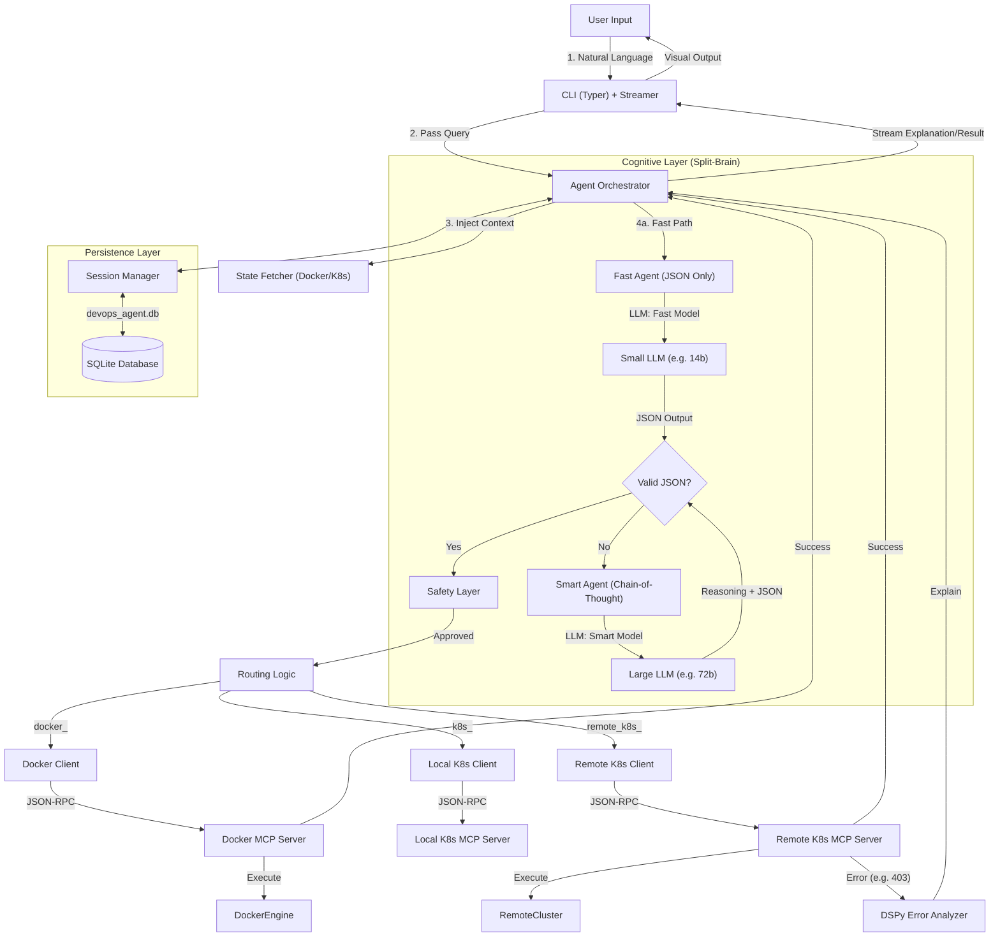

# Architecture and Developer Guide

This document provides a comprehensive, deep-dive overview of the DevOps Agent architecture. It goes beyond the high-level summary to explain the internal mechanisms of the AI orchestration, the Model Context Protocol (MCP) implementation, and the split-brain reasoning engine.

## 1. Introduction

DevOps Agent is an AI-powered CLI tool designed to be the "Copilot for DevOps". Unlike simple wrappers that map text to commands, it uses an agentic architecture with planning, reasoning, and verification layers to ensure safety and reliability when managing Docker and Kubernetes.

## 2. System Overview

The system follows a **Hub-and-Spoke** architecture where a central orchestrator (the Agent) communicates with specialized Spoke servers (MCP Servers) that handle actual infrastructure interaction.

### High-Level Layers

1.  **Presentation Layer (CLI):** Typer-based CLI for handling user input, rendering rich UI (spinners, tables), and managing session state.
2.  **Cognitive Layer (DSPy Agent):** A Python-based AI agent that uses "Split-Brain" architecture to balance speed (Zero-Shot) and intelligence (Chain-of-Thought).
3.  **Communication Layer (MCP Client):** A robust JSON-RPC 2.0 client handling synchronous and asynchronous communication.
4.  **Execution Layer (MCP Servers):** Three independent HTTP/JSON-RPC servers running in separate processes for isolation.
5.  **Persistence Layer (SQLite):** A structured relational database for storing conversation history and context.

---

## 3. Architecture Diagram



---

## 4. Deep Dive: The Cognitive Layer (DSPy)

The core intelligence is built using **DSPy** (Declarative Self-improving Python), which replaces brittle prompt engineering with modular, optimizable signatures.

### 4.1 Split-Brain Architecture

The agent uses a "Split-Brain" routing mechanism to optimize for both latency and complex reasoning.

#### **Path A: The Fast Lane (Zero-Shot)**
Used for simple, unambiguous commands like "list pods" or "start nginx".
- **Module:** `FastDockerAgent`
- **Signature:** `FastDockerSignature`
- **Logic:**
    1.  Receives query + history + tools schema.
    2.  Instructed to output **ONLY JSON**. No reasoning, no "thoughts".
    3.  **Model:** Uses a smaller/faster model (e.g., `llama3.2` or `qwen2.5:14b`).
    4.  **Latency:** ~1-2 seconds.

**Signature Definition (`FastDockerSignature`):**
```python
class FastDockerSignature(dspy.Signature):
    """
    You are a high-performance JSON API.
    Input: user_query, history_context, available_tools
    Output: JSON List of tool calls.
    Constraints: Output ONLY JSON.
    """
    history_context = dspy.InputField()
    available_tools = dspy.InputField()
    user_query = dspy.InputField()
    tool_calls = dspy.OutputField()
```

#### **Path B: The Smart Lane (Chain-of-Thought)**
Used when Fast Lane fails validation, or for complex queries requiring multi-step reasoning.
- **Module:** `DockerAgent` (wrapping `dspy.ChainOfThought`)
- **Signature:** `DockerAgentSignature`
- **Logic:**
    1.  **Analyze:** Break down user intent.
    2.  **Think:** "I need to check X before doing Y."
    3.  **Plan:** Select tool parameters based on context.
    4.  **Output:** Returns a `Reasoning` string + `JSON` tool calls.
    5.  **Model:** Uses a larger/reasoning model (e.g., `qwen2.5:72b` via remote).

**Signature Definition (`DockerAgentSignature`):**
```python
class DockerAgentSignature(dspy.Signature):
    """
    You are an intelligent Assistant.
    Instructions:
    1. ANALYZE history and query.
    2. THINK step-by-step.
    3. CHECK available_tools tools/args.
    4. OUTPUT "Reasoning" and "tool_calls".
    """
    # ... inputs ...
    tool_calls = dspy.OutputField(desc="JSON list of tool calls")
```

### 4.2 Semantic Verification & Retry Loop
The output from the LLM is **never** trusted blindly. It passes through a rigorous validation pipeline:
1.  **JSON Validation:** `json_repair` is used to fix common LLM JSON syntax errors (missing brackets, trailing commas).
2.  **Schema Validation:** Checked against Pydantic models to ensure the structure is correct `[{"name": "...", "arguments": {...}}]`.
3.  **Semantic Verification:** 
    - Does the tool exist in `ALL_TOOLS`?
    - Are all **required arguments** present?
    - If any check fails, the error is fed back into the Smart Agent for a **Self-Correction Retry**.

---

## 5. Deep Dive: Model Context Protocol (MCP)

This project implements the MCP specification to decouple the AI agent from the tools. This ensures security and process isolation.

### 5.1 Server-Side Implementation (`mcp/docker_server.py`)
Each server is a standalone process using `Werkzeug` (WSGI) and `json-rpc`.

- **Handler Factory:** Tools are not hardcoded. A factory function `create_tool_handler(tool_name)` dynamically wraps `Tool.run()` methods into JSON-RPC compliant handlers.
- **Registry:** Tools are automatically discovered from `tools/__init__.py`.
- **Isolation:** 
    - Port 8080: Docker Server (Interacts with Docker Daemon)
    - Port 8081: Local K8s Server (Interacts with `kubectl proxy`)
    - Port 8082: Remote K8s Server (Interacts with Remote Cluster API)

### 5.2 Client-Side Communication (`mcp/client.py`)
The client handles the routing and protocol details.

- **Routing:** Functions like `call_tool_async` inspect the `tool_name` prefix:
    - `remote_k8s_*` -> Routes to Port 8082
    - `local_k8s_*` -> Routes to Port 8081
    - `docker_*` -> Routes to Port 8080
- **Asynchronous:** Uses `httpx` for non-blocking calls, allowing the UI to remain responsive.
- **Failover:** Includes synchronous `requests` fallback for legacy compatibility.

---

## 6. Deep Dive: Safety Layer (`safety.py`)

The Safety Layer acts as a final "circuit breaker" before any destructive action is sent to the MCP servers.

**Logic:**
1.  **Interception:** Every tool call approved by the Validator passes through `confirm_action(tool_name, args)`.
2.  **Classification:** The tool name is checked against `DANGEROUS_TOOLS` set (e.g., `docker_stop_container`, `docker_prune`).
3.  **Prompting:**
    - **Simple Mode:** "Do you want to stop container X?" (Yes/No)
    - **Detailed Mode:** Displays "IMPACT ANALYSIS" (Data loss warnings, side effects) and requires typing "CONFIRM".
4.  **Enforcement:** If user says "No", the execution chain is strictly aborted.

---

## 7. Deep Dive: Persistence Layer

State is managed via a SQLite database (`devops_agent.db`) to ensure conversations survive restarts.

### 7.1 Schema (`database/db.py`)

**Table: `sessions`**
| Column | Type | Description |
| :--- | :--- | :--- |
| `id` | TEXT (PK) | UUID of the session |
| `title` | TEXT | User-friendly name ("Debugging Nginx") |
| `created_at` | TEXT | ISO timestamp |
| `context_state` | TEXT (JSON) | Last known state (e.g., last mentioned pod) |

**Table: `messages`**
| Column | Type | Description |
| :--- | :--- | :--- |
| `id` | INTEGER (PK) | Auto-increment ID |
| `session_id` | TEXT (FK) | Reference to `sessions.id` |
| `role` | TEXT | `user`, `assistant`, or `system` |
| `content` | TEXT | The actual query or response |
| `timestamp` | TEXT | ISO timestamp |

---

## 8. Developer Guide: Adding a New Tool

Extending the agent is designed to be simple. Follow this pattern:

### Step 1: Create the Tool Class
Create a new file `devops_agent/tools/my_new_tool.py`:

```python
from .base import Tool

class MyNewTool(Tool):
    name = "my_new_tool"
    description = "Description of what it does"
    
    def get_parameters_schema(self) -> dict:
        return {
            "type": "object",
            "properties": {
                "arg1": {"type": "string", "description": "Argument 1"}
            },
            "required": ["arg1"]
        }
    
    def run(self, **kwargs) -> dict:
        arg1 = kwargs.get('arg1')
        # Logic here
        return {"success": True, "data": f"Processed {arg1}"}
```

### Step 2: Register the Tool
Update `devops_agent/tools/__init__.py`:

```python
from .my_new_tool import MyNewTool

ALL_TOOLS = [
    # ... existing tools ...
    MyNewTool()
]
```

### Step 3: Classification (Optional)
If the tool is dangerous, add it to `DANGEROUS_TOOLS` in `devops_agent/safety.py`.

### Step 4: Restart
Run `devops-agent start-all`. The tool is automatically discovered, registered with the MCP dispatcher, and exposed to the LLM.

---

## 9. Error Handling Strategy

The system distinguishes between **Operational Errors** and **Cognitive Errors**.

- **Operational Errors (403, 404, 500):**
    - Captured by the MCP Server.
    - Returned as `{ "success": False, "error": "..." }`.
    - Intercepted by `ErrorAnalyzer` (DSPy module) to generate a human-friendly "Fix-It" guide (e.g., "The pod exists but you don't have permission. Run `kubectl apply ...`").
- **Cognitive Errors (Hallucinations):**
    - Detected by the `Validator` (Semantic Check).
    - Triggers the `Self-Correction` loop in the Smart Agent.

---

## 10. Configuration Reference

Configuration is centralized in `settings.py` (Pydantic Settings).

| Variable | Description |
| :--- | :--- |
| `DEVOPS_LLM_HOST` | Ollama URL (Default: `localhost:11434`) |
| `DEVOPS_LLM_MODEL` | Smart Model (Default: `llama3.2`) |
| `DEVOPS_LLM_FAST_MODEL` | Fast Model (Optional, defaults to Smart) |
| `DEVOPS_SAFETY_CONFIRM` | Toggle safety prompts (`true`/`false`) |
| `DEVOPS_DATABASE_NAME` | DB Filename (Default: `devops_agent.db`) |

---

## 11. Conclusion

This architecture allows the DevOps Agent to scale from simple local tasks to complex, multi-cluster remote management. By properly separating concerns (Cognition vs Execution) and enforcing safety at the protocol level, it provides a stable platform for AI-driven infrastructure operations.