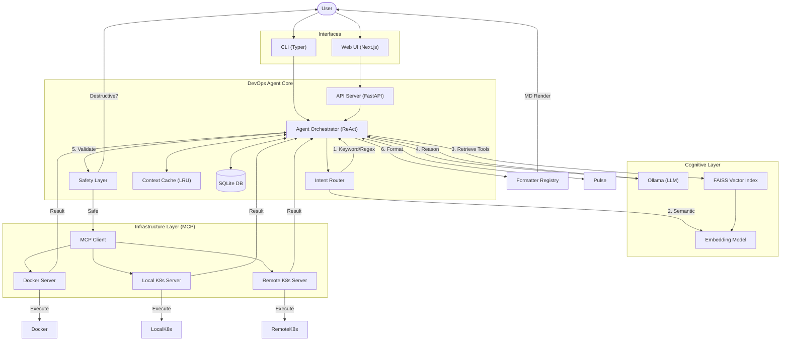
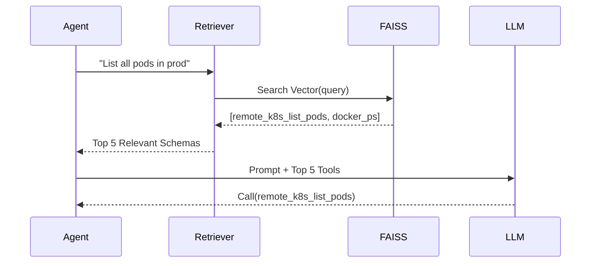
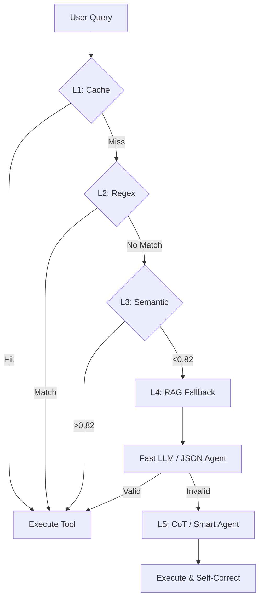

# Architecture and Developer Guide

This document provides a comprehensive, deep-dive overview of the DevOps Agent architecture. It goes beyond the high-level summary to explain the internal mechanisms of the AI orchestration, the Model Context Protocol (MCP) implementation, and the split-brain reasoning engine.

## 1. Introduction: The Vision

The DevOps Agent is not just a chatbot; it is a **Distributed AI Orchestration System** designed to bridge the gap between high-level natural language and low-level infrastructure operations. 

In a traditional DevOps environment, an engineer must remember thousands of commands across CLI tools (Docker, Kubectl, Helm). The DevOps Agent solves this by:
1.  **Understanding Intent:** Using a multi-stage routing system to determine what the user wants.
2.  **Autonomous Planning:** Using Large Language Models (LLMs) to break complex requests into safe, executable steps.
3.  **Isolated Execution:** Using the **Model Context Protocol (MCP)** to ensure that the "Brain" (AI) and the "Hands" (Tools) live in separate, secure environments.

### Core Philosophy: "Cognition over Computation"
We treat infrastructure as a state machine that can be queried and mutated by an intelligent agent. Safety is not an afterthought; it is baked into the protocol via an Interception Layer.

---

### 2.2 Updated Project Structure

```
devops-agent/
├── devops_agent/
│   ├── __init__.py
│   ├── settings.py           # Configuration (Pydantic) - LLM hosts, K8s, etc.
│   ├── cli.py                # Typer CLI - Entry point, Wizard, RAG commands
│   ├── cli_helper.py         # TUI formatting, user interaction logic
│   ├── agent.py              # Core Orchestrator - State machine, tool execution
│   ├── api_server.py         # FastAPI Gateway - REST endpoints + SSE Streaming
│   ├── safety.py             # Safety Layer (Risk Analysis & Interception)
│   ├── router.py             # Intent Router (Regex/Semantic)
│   ├── smart_router.py       # High-level MCP Router (Docker vs K8s)
│   ├── tool_indexer.py       # Tool Registry Sync Logic
│   ├── context_cache.py      # Short-term memory (LRU)
│   ├── database/             # Persistence Layer
│   │   ├── session_manager.py # SQLite wrapper for history
│   │   └── db.py             # SQL schema
│   ├── rag/                  # RAG Engine (New!)
│   │   ├── faiss_index.py    # Vector Store (FAISS) - Add/Search/Save
│   │   └── tool_retriever.py # Retrieval interface
│   ├── mcp/                  # Model Context Protocol
│   │   ├── client.py         # Generic JSON-RPC Client
│   │   ├── server.py         # Docker Server Implementation
│   │   ├── k8s_server.py     # Local Kubernetes Server
│   │   └── remote_k8s_server.py # Remote Kubernetes Server
│   ├── llm/                  # Cognitive Connectors
│   │   └── ollama_client.py  # Ollama API client (Chat/Embeddings)
│   ├── tools/                # Docker Tools (Pydantic Models)
│   └── k8s_tools/            # Kubernetes Tools
├── ui/                       # Next.js Frontend
│   ├── src/components/       # UI Components (ThinkingProcess, Chat, etc)
│   └── ...
├── tests/                    # Pytest Suite
└── ...
```

---

## 3. High-Level Architecture (Updated)



---

## 3.1 "Lightning Fast" Performance Architecture
The project has been hardened with a series of optimizations to achieve sub-100ms internal latency (overhead) even under heavy load:

### 1. Connection Pooling (Shared httpx.AsyncClient)
- **Problem**: Opening a new TCP connection for every tool call and pulse check adds 20-50ms handshake latency.
- **Solution**: A shared, singleton `httpx.AsyncClient` in `mcp/client.py` and `k8s_utils.py`.
- **Impact**: Reuses alive connections, reducing overhead to ~2ms per call.

### 2. Async-First Intelligence
- **Asynchronous SemCache**: The Layer 1.5 cache is fully non-blocking.
- **Asynchronous RAG**: `ToolRetriever` performs FAISS lookups and Ollama embedding generations in parallel background tasks.
- **Async Execution**: The Orchestrator uses `asyncio.gather` to trigger multiple cluster operations (e.g., list logs + describe pod) simultaneously.

### 3. Self-Healing Pulse (`pulse.py`)
- **Async Loops**: Background monitoring runs without blocking the main agent loop.
- **TTL Index Pruning**: The Global Resource Map now includes a pruning mechanism that removes stale entries after 5 minutes, keeping the memory footprint minimal.

### 4. Batch Describe Parallel Execution (New!)
- **Zero-Latency Routing**: `regex_router.py` detects "describe all X" patterns and routes directly to parallel orchestration, bypassing LLM reasoning.
- **Parallel Describe Calls**: `agent.py` uses `asyncio.gather()` to describe multiple resources simultaneously.
- **Smart Output Formatting**: Aggregated results displayed as compact table (default) or full YAML blocks (on request).
- **Supported Commands**:
  - `describe all pending pods`
  - `describe every running deployment`
  - `describe all nodes with full details`
  - `describe all services in kube-system`

---

## 4. Deep Dive: RAG & Tool Retrieval

The system now employs a **Retrieval-Augmented Generation (RAG)** approach to handle scaling toolsets.

### 4.1 The Challenge
With 50+ tools (Docker, K8s, Remote K8s), injecting all schemas into the LLM context window (ctx) is expensive and confusing for smaller models.

### 4.2 The Solution
We index all tools into a local **FAISS** index using `nomic-embed-text` embeddings.

1.  **Indexing**: `tool_indexer.py` scans `tools/` and `k8s_tools/`, generates embeddings, and saves to `data/faiss_index.bin`.
2.  **Retrieval**: `tool_retriever.py` queries the index using the user's prompt.
3.  **Context**: Only the top-k (default 8) most relevant tools are injected into the system prompt.

### 4.3 Flow


---

## 5. Deep Dive: API & Real-Time Streaming

The `api_server.py` enables the modern Web UI experiences.

### 5.1 Endpoints
-   `POST /api/chat/stream`: Main entry point. Uses **Server-Sent Events (SSE)**.
-   `GET /api/status`: Real-time system health (LLM, MCPs).
-   `POST /api/mcp/start`: Controls background processes.
-   `GET /api/config`: Dynamic configuration.

### 5.2 Streaming Protocol (SSE)
The server pushes diverse event types to the client over a single HTTP connection:

| Event Type | Payload | UI Behavior |
|------------|---------|-------------|
| `status` | "Thinking..." | Updates status bar/favicon |
| `thought` | "Checking K8s..." | Adds item to "Thinking Process" accordion |
| `token` | "The" | Appends text to message bubble |
| `tool_calls` | JSON Array | Renders "Tool Used" chip |
| `confirmation_request` | JSON Object | Renders "Approve/Deny" card |
| `done` | "[DONE]" | Finalizes message state |

---

## 5.3 Deep Dive: Infrastructure Pulse (`pulse.py`)

The **Infrastructure Pulse** is a background monitoring service that ensures the Agent remains aware of the real-time state of the infrastructure without incurring the latency of ad-hoc API calls.

### 5.3.1 Health Monitoring
- **Frequency**: Docker (10s), Local K8s (30s), Remote K8s (60s).
- **Mechanism**: Periodically pings provider health and connectivity.
- **UI Sync**: Health status is pushed to the `Sidebar.tsx` and `MCPManager.tsx` to provide amber/green status indicators.

### 5.3.2 Implicit Discovery Engine
One of the most powerful features of Pulse is building a **Global Resource Map** in the background:
1.  **Scanning**: Every 60s, Pulse scans all known namespaces/deployments/pods across all MCPs.
2.  **Indexing**: It builds a reverse lookup table: `ResourceName -> {MCP_ID, Namespace}`.
3.  **Consumption**: If a user says "Describe pod web-app" without a namespace, the `RegexRouter` or `Agent` queries this index to resolve the exact location, bypassing the need for user input.

---

## 5.4 Deep Dive: Intelligent Error Diagnosis

Raw API errors are often unhelpful (e.g., `403 Forbidden`). The DevOps Agent uses a specialized **Intelligence Loop** for recovery:

### 5.4.1 The "Raw Error" Propagation
All K8s tools use a custom `safe_k8s_request()` wrapper in `k8s_utils.py`. When an API call fails:
- It returns `success: False`.
- It captures the **entire raw response body** as `raw_error`.

### 5.4.2 The `ErrorAnalyzer` Module
When the Agent detects a failure payload, it invokes the `ErrorAnalyzer` (a specialized DSPy module):
1.  **Reasoning**: Analyzes the raw JSON (e.g., specific RBAC message or admission webhook rejection).
2.  **Synthesis**: Generates a 3-part response: **What Happened**, **Technical Why**, and **Concrete Fix**.
3.  **UI Rendering**: The `MessageBubble.tsx` detects the failure signature and renders the explanation in a specialized glassmorphic **Diagnosis Card**.

---

## 6. Model Context Protocol (MCP)

This layer abstracts the differences between local processes, Docker containers, and Kubernetes API calls.

### 6.1 Server Isolation
Each MCP server runs as a separate process (see `api_server.py:MCP_PROCESSES`). This isolation ensures:
-   **Stability**: If the K8s server crashes, Docker commands still work.
-   **Security**: Servers can run with different permissions (future work).
-   **Parallelism**: Independent event loops.

---

## 7. Safety & "Human-in-the-Loop"

### 7.1 Risk Analysis (`safety.py`)
Every tool call is routed through `analyze_risk()`.
-   **Green**: Safe read-only operations (`list`, `get`, `describe`).
-   **Red**: Destructive operations (`delete`, `rm`, `exec`).

### 7.2 Interception
If Risk is HIGH:
1.  Agent pauses execution.
2.  Returns a `confirmation_request` object (not a tool call).
3.  UI displays the "Approval Card".
4.  User clicks "Approve" -> Front-end calls `/api/chat/confirm`.
5.  Agent resumes execution.

---

## 4. Deep Dive: The Cognitive Layer (DSPy)

The core intelligence is built using **DSPy** (Declarative Self-improving Python), which replaces brittle prompt engineering with modular, optimizable signatures.

### 4.1 Split-Brain Architecture: The Decision Logic

The agent uses a "Split-Brain" routing mechanism to optimize for both latency and complex reasoning. This is implemented in `agent.py` through a tiered promotion logic.

#### **Tier 1: The Fast Path (Zero-Shot JSON)**
- **When:** Used for queries that appear structured or simple (e.g., "ps", "ls", "stop x").
- **Agent:** `FastDevOpsAgent`.
- **Model:** Designed for "Small LLMs" (e.g., Llama 3.2 3B/8B).
- **Mechanism:** The model is given a prompt that forbids any natural language output. It receives the `available_tools` schema and must return a raw JSON list.
- **Latency:** ~500ms - 1500ms.

#### **Tier 2: The Logic Path (Chain-of-Thought)**
- **When:** Triggered if Tier 1 fails (unparseable JSON) or if the query involves multi-step reasoning (e.g., "Find the crashed pod and restart it").
- **Agent:** `DevOpsAgent` (CoT).
- **Model:** Designed for "Reasoning LLMs" (e.g., Qwen 2.5 72B, GPT-4).
- **Mechanism:** The model must generate a `Rationale` before the tool calls. This peer-review process significantly reduces hallucinations.
- **Latency:** ~3000ms - 6000ms.

### 4.2 The Orchestration Pipeline (`agent.py`)

Every query follows this internal state machine within the `DevOpsAgent` class:

1.  **Ingress:** Receives query + session ID.
2.  **Context Loading:** Loads `messages` and `context_state` (entities) from SQLite.
3.  **Entity Injection:** Injects "Known Entities" (e.g., `{ active_pod: "nginx-123" }`) into the description of the `user_query` field.
4.  **Routing Check:** Calls the `IntentRouter`. If it matches L1/L2/L3, it skips LLM reasoning entirely.
5.  **RAG Tool Retrieval:** If routing misses, it vector-searches for the 8 most relevant tools.
6.  **Path Execution:** Executes Tier 1 (Fast) or Tier 2 (Smart).
7.  **Semantic Validator:** Verifies tool names and argument types.
8.  **Self-Correction Loop:** If validation fails, it re-prompts the Smart Agent with the error message. *Max Retries: 2.*

### 4.3 Signatures & Programmatic Prompting
Instead of long strings, we use **DSPy Signatures**. This treats prompting like defining a function.
- **`FastDevOpsSignature`**: A strict JSON-only signature for the zero-shot agent.
- **`DevOpsAgentSignature`**: A Chain-of-Thought signature that forces the model to document its "Rationale" before emitting JSON.
- **Singleton LM Initialization (`dspy_client.py`)**: 
    - We use a singleton pattern to ensure LMs are only initialized once.
    - **Model Auto-Pull:** If the configured model is missing from the Ollama host, the client automatically triggers a `pull` operation during startup.

### 4.4 The "Repair" Mechanism (`agent_module.py`)
Hallucinations are handled by `_validate_and_parse`. If the LLM returns prose instead of JSON, we use `json-repair` to extract the payload. If that fails, the error is injected into a retry prompt:
```python
if last_error:
    modified_query = f"{query}\n\n[SYSTEM: Your previous response was invalid. Error: {last_error}.]"
```

---

## 5. The Optimization Pipeline (`optimize.py`)

The agent doesn't just "stay static". It can be "compiled" to perform better on specific infrastructure tasks.

### 5.1 Synthetic Data Generation
We use `scripts/generate_synthetic_data.py` to create "Gold Standard" traces. This script simulates common DevOps failures and records the perfect tool-call response.

### 5.2 BootstrapFewShot Optimizer
1.  **Selection:** We pick the best 4 examples from `synthetic_examples.json`.
2.  **Bootstrapping:** The "Smart Agent" (Teacher) runs against the "Fast Agent" (Student).
3.  **Compilation:** The optimized prompts (the "few-shot demos") are saved into `compiled_agent.json`.
4.  **Deployment:** At runtime, the agent checks for this JSON and loads it, instantly gaining the intelligence of the few-shot examples without increasing inference time.
    """
    history_context = dspy.InputField(desc="Previous conversation turns")
    current_state = dspy.InputField(desc="Recognized entities (pods, containers)")
    available_tools = dspy.InputField(desc="JSON Schema of tools")
    user_query = dspy.InputField()
    
    # The output is a typed string we manually parse/validate
    tool_calls = dspy.OutputField(desc="JSON list of tool calls")
```

### 4.2 The Orchestrator (`agent.py`)

The `process_query_async` function is the entry point for all cognitive tasks. It manages a stateful pipeline:

1.  **Context Loading:** Fetches the last 10 messages from SQLite and resolves the `ActiveSession`. 
2.  **State Injection:** Crucial step. It scans for "Entities" in the history (Pod Names, Container IDs, IP addresses) and injects them into the `current_state` field of the signature description. This allows the LLM to know what "it" refers to in *"Restart it"*.
3.  **Intent Pre-Routing:** Calls `router.py` to see if a high-speed match exists.
4.  **Dynamic Tool Selection:** If Routing fails, it uses the `ToolRetriever` to select the top 8 tools.
5.  **Path Execution:** 
    *   Attempts **Fast Path** first. 
    *   If Fast Path returns unparseable JSON or invalid tool calls, it automatically "promotes" the query to the **Smart Path**.
6.  **Streaming Thoughts:** The Smart Path generates a sequence of "Thoughts" before producing tool calls. These thoughts are pushed to an `asyncio.Queue` and emitted as SSE events `event: thought` in real-time.

### 4.3 Semantic Verification & Retry Loop
The output from the LLM is **never** trusted blindly. It passes through a rigorous validation pipeline:
1.  **JSON Validation:** `json_repair` is used to fix common LLM JSON syntax errors (missing brackets, trailing commas, or markdown code blocks wrapped around the JSON).
2.  **Schema Validation:** Checked against Pydantic models to ensure the structure is correct `[{"name": "...", "arguments": {...}}]`.
3.  **Semantic Verification:** 
    *   **Registry Check:** Does the tool exist in `ALL_TOOLS`?
    *   **Type Casting:** Arguments are cast to their expected types (e.g., converting a string `"8080"` to an int `8080`).
    *   **Constraint Check:** Are all **required arguments** present?
4.  **Self-Correction:** If any check fails (e.g., LLM invented a tool called `k8s_delete_everything`), the error message + original output are fed back into the Smart Agent for a **Self-Correction Retry**. The agent is told: *"Your previous output was invalid because of [ERROR]. Please try again."*

### 4.4 Signatures & Programmatic Prompting
Unlike traditional "Text Prompting", the agent uses **DSPy Signatures**. This allows us to treat the LLM as a typed function with defined inputs and outputs.

#### **Signature 1: The Reasoner (`SmartPath`)**
This signature is designed for high-context Chain-of-Thought.
- **Goal:** Understand intent, verify state, generate precise tool calls.
- **Constraints:** Detailed impact analysis included in `reasoning`.

#### **Signature 2: The Actioner (`FastPath`)**
This signature is stripped down for speed.
- **Goal:** Direct mapping of query to JSON.
- **Constraints:** No text output. Strictly `[ { "name": "...", "arguments": { ... } } ]`.

#### **Dynamic State Injection**
Every signature includes a `current_state` field. Before a query is sent to the LLM, the orchestrator runs a "State Snapshot":
1.  **Session Memory:** The last 10 messages are summarized into key entities.
2.  **Entity Resolution:** If history contains `pod: nginx-abc`, it is added to the "Active Entities" list, allowing the LLM to resolve pronouns like *"Restart it"*.
3.  **Active Host Check:** If the current context is a remote cluster, the `remote_k8s` toolset is weighted higher in the prompt context.

---

## 5. Deep Dive: Model Context Protocol (MCP)

This project implements the MCP specification to decouple the AI agent from the tools. This ensures security and process isolation.

### 5.1 Protocol: JSON-RPC 2.0 Over HTTP
We chose JSON-RPC 2.0 for its simplicity and clear error handling.

- **Payload Example:**
  ```json
  {
    "jsonrpc": "2.0",
    "method": "docker_run_container",
    "params": { "image": "nginx", "detach": true },
    "id": 1
  }
  ```
- **Error Propagation:** If a Docker command fails (e.g., "image not found"), the MCP Server returns a standard JSON-RPC Error object. The AI agent captures this as a `tool_result` and analyzes it.

### 5.2 Server Isolation & Security
Each MCP Server runs as a separate OS process. This provides:
1.  **Dependency Isolation:** The Docker server needs `docker-py`; the K8s server needs `kubernetes`. They don't pollute each other's environments.
2.  **Privilege Separation:** You can run the Docker server as a user with `docker` group access, while the K8s server uses a different service account token.
3.  **Scalability:** Servers can be moved to different hosts entirely by updating `EMBEDDING_HOST` or similar vars in `.env`.

### 5.3 Auto-Discovery Logic
The `Spoke` servers don't require manual tool registration. They use **Python Introspection**:
- At startup, the server scans `devops_agent/tools/`.
- It identifies subclasses of `Tool`.
- It builds a map of `name -> run_method`.
- It generates the JSON-Schema for `get_parameters_schema()` and exposes it via a `list_tools` method.

---

## 5.4 Modular Formatter System (`devops_agent/formatters/`)
To decouple tool execution from result presentation, we use a central `FormatterRegistry`.

### 5.4.1 Registry Dispatch
Inside `agent.py`, rather than having a nested `if/else` for every tool, we call:
```python
formatted_result = FormatterRegistry.format(tool_name, result)
```

### 5.4.2 Specialized Formatters
- **DockerFormatter**: Handles container lists and image tables.
- **KubernetesFormatter**: Renders pods, nodes, and deployments with status-colored indicators.
- **DiagnosticFormatter**: Automatically triggered if `success: False`. It uses the `ErrorAnalyzer` to Provide a human-friendly explanation of why a K8s command failed.

---

## 6. Deep Dive: Safety Layer (`safety.py`)

The Safety Layer acts as a final "circuit breaker" before any destructive action is sent to the MCP servers.

### 5.3 Reflection & Auto-Discovery
MCP servers use Python's `inspect` module to automatically generate JSON-RPC manifests.
- **How it works:** Any method decorated with `@tool` in the spoke is scanned for its docstring and type hints.
- **The Result:** The Agent doesn't need to be manually updated when a new tool is added to a spoke; it "discovers" it at startup.

---

## 6. Infrastructure Abstraction Layer (`k8s_base.py`)

To support multiple clusters (Local vs. Remote) without duplicating code, we use an inheritance-based abstraction.

### 6.1 The Base Tool Pattern
All Kubernetes tools inherit from `K8sBaseTool`. This class handles:
- **Client Initialization:** Deciding whether to use `config.load_kube_config()` or `config.load_incluster_config()`.
- **Global Arguments:** Automatically injecting `--namespace` or `--context` into every command.
- **Error Normalization:** Catching `kubernetes.client.rest.ApiException` and converting it into a standard JSON error dict.

---

## 7. Security Model & Sandboxing

The system is designed with a "Defense in Depth" strategy.

### 7.1 Process Isolation
Each MCP spoke (Docker, Local K8s, Remote K8s) runs as a **separate operating system process**.
- **Impact:** If the Docker spoke crashes or is compromised, the K8s spokes remain isolated.
- **Communication:** Restricted to local JSON-RPC pulses over loopback (127.0.0.1).

### 7.2 The Safety Interceptor (`safety.py`)
Before any tool call reaches the network, it must pass through the `SafetyLayer`.
- **Heuristic Scanning:** Arguments are checked for destructive flags (e.g., `--force`, `rm -rf`, `prune`).
- **State Suspension:** If a risk is detected, the agent state is saved to SQLite, and an `event: confirmation_request` is sent to the UI. The tool call is NOT executed until a signed confirmation is received.

---

## 7. Deep Dive: Persistence Layer (State & Memory)

The agent needs to remember things like which pod you were just talking about. We use SQLite for this because it's local, fast, and requires no external infra.

### 7.1 Database Schema (`database/db.py`)
- **`sessions` Table:**
    - `id`: UUID.
    - `context_state`: A JSON blob containing "Extracted Entities".
- **`messages` Table:**
    - `role`: user, assistant, or system.
    - `content`: The text.
    - `thoughts`: (Assistant only) The thinking process.

### 7.2 Entity Extraction (The "It" Problem)
After every successful tool call, the `SessionManager` looks at the result. If a pod name `nginx-xyz` is found, it is added to the session's `context_state`. 
- **Example:**
    - User: "List pods"
    - Agent: (Calls tools, finds `nginx-123`) -> Updates `context_state["active_entities"]["pod"] = "nginx-123"`.
    - User: "Restart it"
    - Agent: Sees "it", checks `context_state`, finds `nginx-123`, and builds the restart command automatically.

---

### Step 1: Create the Tool Class
Tools inherit from `devops_agent.tools.base.Tool`.

```python
class MyNewTool(Tool):
    name = "my_new_tool" # Must be unique across all servers
    description = "Used by the AI to do X. Be very descriptive here."
    
    def get_parameters_schema(self) -> dict:
        """Returns a standard JSON-Schema."""
        return {
            "type": "object",
            "properties": {
                "target": {"type": "string", "description": "The target resource"}
            },
            "required": ["target"]
        }
    
    def run(self, **kwargs) -> dict:
        """The actual execution logic. Must return a dict."""
        target = kwargs.get('target')
        # ... logic ...
        return {"success": True, "output": f"Modified {target}"}
```

### Step 2: Register the Tool
Add your tool instance to `ALL_TOOLS` in `devops_agent/tools/__init__.py`. 

### Step 3: Distribution
Decide which MCP server should host this tool:
- If it's a Docker tool, the Docker MCP server will automatically pick it up via reflection.
- If it's a Kubernetes tool, ensure its name starts with `local_k8s_` or `remote_k8s_` so the client routes it correctly.

---

## 9. Error Analysis Engine (`ErrorAnalyzer`)

Raw shell errors are hard for users (and sometimes LLMs) to understand. We use a dedicated DSPy module to "Translate" these errors.

1.  **Detection:** A tool returns `success: False`.
2.  **Analysis:** The `ErrorAnalyzer` signature receives the query + error.
3.  **Output:** It generates a "Friendly Guide".
    - *Example:* "I couldn't find the pod 'web-1'. It looks like you're in the 'default' namespace but the pod is in 'production'. Try adding '--namespace production'."
- **Cognitive Errors (Hallucinations):**
    - Detected by the `Validator` (Semantic Check).
    - Triggers the `Self-Correction` loop in the Smart Agent.

### 9.1 DSPy Error Analyzer
A specialized module `ErrorAnalyzer(dspy.Module)` is used to turn cryptic infrastructure errors into clear DevOps advice.
- **Input:** `tool_result` (error), `user_query`.
- **Output:** `explanation`, `proposed_fix`.
- **Example:** 
    - *Raw Error:* `rpc error: code = PermissionDenied desc = ...`
    - *Analyzed Output:* "You don't have permission to list pods. Your RBAC token might be expired. Try running `gcloud auth application-default login`."

---

## 10. Configuration Management (`settings.py`)

The system uses `pydantic-settings` for robust, type-checked configuration.

### 10.1 Variable Priority
Settings are loaded in the following order (higher overrides lower):
1.  **Direct Overrides:** Passed via the Python constructor (rare).
2.  **Environment Variables:** Prefixed with `DEVOPS_` (e.g., `DEVOPS_LLM_MODEL`).
3.  **.env File:** Scanned in the root directory.
4.  **Defaults:** Hardcoded in the `AgenticSettings` class.

### 10.2 Core Variables
| Variable | Default | Purpose |
| :--- | :--- | :--- |
| `LLM_HOST` | `localhost:11434` | The primary Ollama endpoint. |
| `LLM_MODEL` | `llama3.2` | The "Smart Agent" model name. |
| `LLM_FAST_MODEL` | `None` | If set, Tier 1 uses this model. |
| `EMBEDDING_MODEL` | `nomic-embed` | The vector model. |
| `SAFETY_CONFIRM` | `True` | Global kill-switch for safety prompts. |

## 11. The Startup Wizard (`cli.py`)

The `start-all` command is more than a simple launcher; it is an intelligent environment orchestrator.

### 11.1 The Dependency Chain
Before launching the servers, the wizard performs a series of sanity checks:
1.  **Ollama Reachability:** Pings the LLM host.
2.  **Model Availability:** Scans for Smart, Fast, and Embedding models. If missing, it offers to `ollama pull` them automatically.
3.  **Port Availability:** Checks if ports 8080, 8081, 8082, and 8088 are free.
4.  **K8s Connectivity:** Pings `kubectl` and checks for an active context.

### 11.2 Interactive Configuration
If a `.env` file is missing, the wizard enters **Interactive Mode**:
- **Host Selection:** Detects local vs remote Ollama.
- **Model Picker:** Lists all models currently pulled on the host.
- **Fast Path Toggle:** Allows the user to opt-in to the "Split-Brain" optimization.

### 11.3 Process Management & Heartbeats
The wizard uses the `subprocess` module to spawn and monitor the 4 core servers (API + 3 MCP Spokes). 

- **Supervision:** It maintains a list of `Popen` objects. 
- **Telemetry:** It pipes their `stdout` and `stderr` to a unified log stream.
- **Auto-Recovery:** If a spoke crashes with a non-zero exit code, the wizard detects it via `poll()` and reports the exact failure to the console using `rich.console`.
- **Cleanup:** On `Ctrl+C` (SIGINT), the wizard sends `SIGTERM` to all children to ensure no zombie processes are left on ports 8080-8088.

---

## 11. Deep Dive: Dedicated Embedding Model (Phase 7)

Embeddings are used for:
- **IntentRouter:** Semantic similarity matching for fast routing
- **ToolRetriever:** RAG-based tool selection fallback

### 11.1 Problem: LLM Embedding Latency

Using a large LLM (e.g., 72B) for embeddings causes **500-2000ms latency per query**.

### 11.2 Solution: Dedicated Lightweight Model

| Configuration | Model | Latency |
|--------------|-------|--------|
| Before | qwen2.5:72b (remote) | ~1000ms |
| After | nomic-embed-text (local) | ~20ms |

### 11.3 Implementation

**settings.py:**
```python
EMBEDDING_MODEL: str = "nomic-embed-text"
EMBEDDING_HOST: str = "http://localhost:11434"
```

**ollama_client.py:**
```python
def get_embeddings(text: str, model: str = None, host: str = None):
    target_host = host or settings.EMBEDDING_HOST
    target_model = model or settings.EMBEDDING_MODEL
    # Uses dedicated client for embedding host
```

### 11.4 CLI/UI Configuration

Both CLI (`devops-agent start-all`) and Web UI (`ConfigModal.tsx`) include a third section for embedding model configuration.

---

## 12. Web UI Architecture

The project includes a modern Next.js web interface.

### 12.1 The Streaming Protocol (SSE)
We use Server-Sent Events (SSE) to provide an "Instant" feel. 

- **Frontend:** The `Chat.tsx` component uses `EventSource` to listen to `/api/chat/stream`.
- **Backend:** The `api_server.py` uses a `StreamingResponse` wrapping an `async generator`.
- **Event Flow:**
    1. `event: status`: The agent is starting.
    2. `event: thought`: The reasoning process.
    3. `event: tool_call`: Which tool is being invoked.
    4. `event: confirmation_request`: Safety interception.
    5. `event: token`: The final text being typed out.

### 12.2 Component Architecture
- **`Sidebar.tsx`**: Manages session switching and live status polling of the Ollama hosts.
- **`ConfigModal.tsx`**: A wizard that allows users to swap models at runtime by hitting the `POST /api/config` endpoint.
- **`Message.tsx`**: Uses `react-markdown` to render rich text, logs, and tables returned by the agent.

---

- **REST:** 
    - `GET /api/sessions`: List all active conversations.
    - `POST /api/config`: Apply host/model changes without restarting.
    - `GET /api/status`: Health check for all 3 agents and 3 MCP servers.
- **SSE (`/api/chat/stream`):** The primary data pipe.

#### **Real-Time Event Payloads (SSE)**
| Event Type | Payload Example | UI Response |
| :--- | :--- | :--- |
| `status` | `"Thinking..."` | Show pulsing spinner |
| `thought` | `"Searching for pod..."` | Append to "Thought" sidebar |
| `token` | `{ "token": "Hello" }` | Stream text to message bubble |
| `tool_calls` | `[{ "name": "..." }]` | Show "Executing Tool" indicator |
| `confirmation_request` | `{ "tool": "..." }` | Render Glassmorphic Approval Card |
| `done` | `"[DONE]"` | Close stream, save session |

See [ui/DEEP_DIVE_UI.md](ui/DEEP_DIVE_UI.md) for detailed component documentation.

---

---

## 13. High-Performance Intent Routing: The 5-Layer Cascade

To achieve sub-50ms latency for common tasks while maintaining 100% accuracy for complex ones, we use a "Layered Intent Cascade". This funnel progressively uses more expensive "cognitive compute" only when necessary.



### Layer 0: Smart MCP Router (`smart_router.py`)
- **Mechanism:** A rapid keyword-matching engine that segments queries into **MCP Domains** (Docker, Local K8s, Remote K8s) *before* any tool selection happens.
- **Sticky Context:** Wraps a `ContextCache` detecting follow-up pronouns ("it", "that", "describe"). If found, it routes to the **Last Active MCP**.
- **Optimization:** Prevents loading 40+ tools into the LLM context when the user just wants "Docker help".

### Layer 1: Context-Aware LRU Cache (`router.py`)
- **Mechanism:** A simple Python dictionary (LRU) that stores exact string matches.
- **Optimization:** If a user repeats a command (e.g., "list pods"), the system returns the result in **<1ms**.
- **Context Awareness:** The cache key includes the `session_id` to ensure that "restart it" resolves correctly based on that specific session's history.

### Layer 2: Instant Smart Match (RegexRouter - New!)
- **Mechanism:** A dedicated `RegexRouter` class that handles high-frequency commands with **Zero LLM Latency**.
- **Smart Extraction:** Uses **Named Capture Groups** (e.g., `(?P<namespace>.*)`) to instantly populate tool arguments.
- **Auto-Normalization:** Automatically standardizes input (e.g., lowercase "pending" -> K8s-native "Pending").
- **Parameter Injection:** Injects default safety/performance parameters (like `limit: 50`) automatically.
- **Example:**
    - Query: "list pending pods in kube-system"
    - Logic: Detects `k8s_list_pods`, extracts `namespace="kube-system"`, `status_phase="Pending"`, `limit=50`.
    - Speed: **<0.5ms**.

---

## 5. Optimized Data Handling

To handle large-scale clusters without overwhelming the LLM context or the UI, the agent implements several performance patterns.

### 5.1 Server-Side Filtering
The agent prioritizes **Filter-at-Source**. MCP tools support:
- `label_selector`: passed directly to Kubernetes API.
- `status_phase`: mapped to `fieldSelector` for pods/nodes.
- `limit`: restricts the raw object count returned by the API server.

### 5.2 Smart Summarization & Adaptive Truncation
When datasets are large, the Agent doesn't just dump raw tables:
1. **Status Summary**: Collapses details into a one-liner (e.g., `Running: 45 | Pending: 5 | Failed: 2`).
2. **Adaptive Truncation**: Only the first 20-25 items are rendered in the Markdown table.
3. **Instructional UX**: Appends a note explaining *how* to use the new filters to find specific resources.

### Layer 3: Semantic Similarity Thresholding (`router.py`)
- **Mechanism:** The query is converted into a vector using the dedicated embedding model (Nomic).
- **The Math:** We calculate the **Cosine Similarity** between the query vector and a library of "Intent Anchors".
- **Threshold (0.82):** This specific value was chosen through benchmarking to prevent "False Positives" while allowing for natural language variations (e.g., "reboot container" vs "restart pod").

### Layer 4: Intelligence-Driven RAG Fallback (`rag/tool_retriever.py`)
If the deterministic layers (L1-L3) fail, we engage the LLM. However, sending 50+ tool definitions to a 72B model would be slow and context-heavy.
- **The Index:** Every tool's `name` and `description` are pre-embedded in `tool_embeddings.json`.
- **Top-K Retrieval:** We perform a vector search for the top 8 most relevant tools.
- **In-Context Injection:** Only these 8 tools are injected into the LLM's prompt. This significantly reduces tokens and improves reasoning accuracy (no "Lost in the Middle" errors).

### Layer 5: Recursive Self-Correction Loop (`agent_module.py`)
If the LLM generates an invalid tool call or fails a semantic check (e.g., missing a required argument):
- **Feedback Injection:** The error message is appended back to the LLM's context.
- **CoT Promotion:** The "Fast Agent" (Zero-Shot) is promoted to "Smart Agent" (Chain-of-Thought).
- **Retry Logic:** The agent has 2 retries to fix the JSON structure or tool arguments before reporting a failure.

---

## 14. Lifecycle: Journey of a Query

To understand the core system, let's trace exactly what happens when a user types: *"Restart the nginx pod in production"*.

### Phase 1: Ingress (Normalization & Context)
- User types: "Restart the pod"
- **Normalization:** Strips whitespace, standardizes casing.
- **Context Injection:** `SessionManager` finds the last mentioned pod `nginx-prod-1` in SQLite. 
- **The Result:** The LLM receives "Restart nginx-prod-1".

### Phase 2: Routing (The Speed Demon)
- The query is checked against the Layered Intent Router.
- **Match:** "Restart [POD]" matches a regex in `intents.json`.
- **The Result:** The system immediately generates the tool call `remote_k8s_restart_pod` without ever waking up the LLM. Time: **<5ms**.

### Phase 3: Cognitive reasoning (The Brain)
- *If routing misses:* The query is sent to the Smart Agent.
- **CoT:** The agent "thinks": "I should first check if the pod exists before restarting."
- **Retrieval:** Only K8s tools are provided via RAG.

### Phase 4: Interception (The Safety Net)
- Before the tool is sent to the K8s Spoke, `safety.py` flags it.
- **Intercept:** The action is "Suspended".
- **Interaction:** The user clicks "Approve" in the UI.

### Phase 5: Execution (The Hands)
- The `MCPClient` sends a POST to the K8s Remote Server.
- **Spoke Action:** The server runs `kubectl rollout restart`.
- **Feedback:** The raw shell output is returned to the agent.

### Phase 6: Synthesis (The Voice)
- The agent takes the shell output ("deployment restarted") and turns it into: "Done! I've kicked off a rolling restart for your nginx pod in the production namespace."
- **Memory:** The `context_state` is updated with the new pod UID.

---

## 16. Testing Strategy

Stability is ensured through a tiered testing approach.

### 16.1 Unit Tests (`tests/`)
- **Tool Logic:** Every `run()` method is tested against mocked Docker/K8s environments.
- **Router Logic:** Regex and Semantic matches are verified via a test suite in `test_router.py`.
- **Database:** `SessionManager` state transitions (entity extraction) are unit tested.

### 16.2 Integration Tests
- **MCP Loopback:** We spawn a mock MCP server and verify that the `client.py` can correctly route and parse results.
- **API End-to-End:** We use `FastAPI.testclient` to simulate a Web UI interaction, hitting the SSE stream and verifying the event types.

---

## 17. Glossary of Terms

| Term | Definition |
| :--- | :--- |
| **MCP** | Model Context Protocol. The standard we use to separate AI from Tools. |
| **DSPy** | The framework used to build our "Cognitive Layer". Replaces prompts with modules. |
| **Spoke** | A standalone server (e.g. `docker_server.py`) that implements a set of tools. |
| **CoT** | Chain-of-Thought. A reasoning technique where the AI "Thinks" before it "Acts". |
| **RAG** | Retrieval-Augmented Generation. Used to find the right tools for a query. |
| **SSE** | Server-Sent Events. The protocol used to stream real-time updates to the UI. |

---

## 18. Conclusion

This architecture allows the DevOps Agent to scale from simple local tasks to complex, multi-cluster remote management. By properly separating concerns (Cognition vs Execution), optimizing latency via multi-host models, and enforcing safety at the protocol level, it provides a stable platform for AI-driven infrastructure operations.