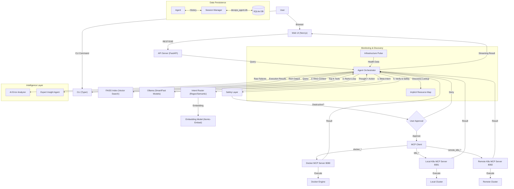

# DevOps Agent


An AI-powered DevOps assistant that understands natural language commands. Control Docker containers, local Kubernetes clusters, and remote Kubernetes clusters using plain English. Built with local LLMs via [Ollama](https://ollama.com/) for privacy, using the Model Context Protocol (MCP) for extensibility.

## Table of Contents

- [Features](#features)
- [Prerequisites](#prerequisites)
- [Installation](#installation)
- [Usage](#usage)
- [Session Management](#session-management)
- [Available Commands](#available-commands)
- [Safety Features](#safety-features)
- [Project Structure](#project-structure)
- [Troubleshooting](#troubleshooting)
- [License](#license)

## Features

- **Natural Language Processing:** Control Docker using plain English (e.g., "Start nginx on port 8080").
- **Local LLM:** Uses Ollama for privacy and offline capability. No external API calls for inference.
- **🧠 AI-Powered (DSPy)**: Uses `dspy` and `llama3.2` for intelligent tool selection and reasoning.
- **🛡️ Safe**: Includes a confirmation prompt for dangerous actions (e.g., stopping containers).
- **🔌 Extensible (MCP)**: Built on the Model Context Protocol, allowing easy addition of new tools.
- **🐳 Docker & K8s**: Supports Docker, Local Kubernetes, and Remote Kubernetes clusters.
- **💾 Persistent**: Saves conversation history to a local SQLite database.
- **Docker SDK:** Safe, programmatic interaction with Docker using the official Python SDK, avoiding raw shell command injection.
- **Remote K8s Management:** Comprehensive management of remote Kubernetes clusters (Pods, Nodes, Deployments, Namespaces).
- **Command Chaining:** Execute multiple actions in a single query (e.g., "Start nginx and list pods").
- **Parallel Execution:** Independent tools are executed in parallel for faster performance.
- **🔄 Batch Describe:** Describe all resources matching a filter in parallel (e.g., "describe all pending pods", "describe every running deployment with full details"). Zero latency routing with automatic parallel execution.
- **Remote Ollama Support:** Connect to powerful remote LLMs (e.g., on HPC or cloud) while keeping the agent local. "Hot-swap" models instantly.
- **High-Performance Intent Routing:**
    - **Smart Match (Regex):** Zero-latency extraction of namespaces, status phases, and resource names (~1ms) bypassing the LLM.
    - **Semantic Similarity:** Vector-based intent matching for natural language variations (~50ms).
    - **RAG Tool Selection:** Dynamically retrieves only relevant tool schemas (Top-K) to minimize prompt overhead.
- **Advanced Control & Filtering:**
    - **Server-Side Filtering:** Native `labelSelector` and `fieldSelector` support for Pods, Nodes, Deployments, and Services.
    - **Smart Pagination:** Automatic `limit` parameters and "Smart Summaries" (e.g., `Running: 45 | Pending: 5`) for large datasets.
    - **Adaptive Truncation:** Large result sets are truncated in the UI with tips on how to filter further, preventing context overflow.
- **Interactive Chat Mode:** Permanent REPL session with context memory (`devops-agent chat`).
- **Reliability Engine:**
    - **Smart MCP Routing:** Automatically detects which tools (Docker, Local K8s, Remote K8s) are needed for a query, optimizing speed and context window.
    - **Sticky Context:** Intelligent "Follow-up" mode. Remembers if you were working on Remote or Local K8s and routes queries like "describe it" accordingly.
    - **Fast/Smart Modes:** Automatically switches between "Fast Mode" (Zero-Shot) for simple queries and "Smart Mode" (Chain-of-Thought) for complex reasoning.
    - **ReAct Prompting:** Agent "thinks" before acting to improve intent detection.
    - **Self-Correction:** Validates tool calls and auto-retries if the LLM hallucinates arguments.
    - **Live Context:** Injects real-time cluster state (running pods/containers) into the prompt to prevent "hallucinated resource" errors.
- **Advanced Inspection:** Comprehensive `describe` tools for Remote K8s (Pods, Services, Namespaces, Nodes) with event logs and status details.
- **UI Routing Overrides:** Manually force the agent into "Docker Only", "Remote K8s Only", or "Chat Only" modes via the Web UI for specialized tasks.
- **Auto-Proxy Config:** Automatically bypasses `NO_PROXY` settings for localhost to prevent connectivity issues in corporate environments.
- **Mix-and-Match Hosts:** Flexible configuration allows Primary (Smart) and Fast models to run on ANY combination of Local or Remote hosts.
- **In-App Model Downloading:** Directly pull missing models via the CLI wizard without leaving the agent.
- **Enhanced Debugging:** "Raw API Error" reporting reveals the exact JSON response from Kubernetes for easier troubleshooting (e.g., distinguishing 403 vs 404).
- **Human-in-the-Loop Safety:** Approval Cards in CLI and Web UI for destructive action confirmation with risk analysis.
- **Dedicated Embedding Model:** Separate lightweight model (`nomic-embed-text`) for fast RAG/semantic search (~20ms vs ~1000ms) stored in a local **FAISS** vector index.
- **Visual "Thinking" UI:** Next.js interface now displays the agent's internal "Chain of Thought" in a collapsible, DeepSeek-style container with real-time timers and step tracking.
- **💓 Proactive Infrastructure Pulse**: Real-time monitoring engine (`pulse.py`) that periodically checks connectivity and health for all MCP providers, providing "Zero-Latency" status dashboarding.
- **🩺 Intelligent Error Diagnosis**: Specialized `ErrorAnalyzer` that transforms cryptic JSON API failures into clear, natural language explanations and actionable "Next Steps".
- **🗺️ Global Infrastructure Map**: Implicit discovery of resources across all namespaces and providers. The agent "knows" where your pod is, even if you don't specify the namespace.
- **🛡️ Enriched Security Intercepts**: Advanced risk assessment with detailed `impact_analysis` (e.g., "Stopping this container will interrupt the 'auth-service'").
- **⚡ "Lightning Fast" Performance Patches**:
    - **Pooled Connections**: Shared `httpx.AsyncClient` with connection pooling for ultra-low latency tool calls (~2ms overhead).
    - **Async-First Intelligence**: Fully asynchronous Semantic Cache and Tool Retriever, eliminating blocking I/O during reasoning.
    - **Self-Healing Pulse**: Background health checks with TTL-based index pruning for a lean, always-accurate resource map.
    - **Modular Output**: registry-based result formatting for faster rendering and cleaner maintenance.
- **Modern Web UI:** Next.js-based dashboard with real-time streaming (SSE), session management, and glassmorphic design.

## Architecture



## Prerequisites

- **Python 3.9 or higher:** Required for the project's dependencies.
- **Docker Engine:** Must be installed and running on your machine.
- **Ollama:** Must be installed to run local LLMs. Download from [https://ollama.com/](https://ollama.com/).
- **`qwen2.5:72b` or `llama3.2`:** The system is configurable but defaults to `qwen2.5:72b` for superior reasoning.
- **`nomic-embed-text`:** Required for RAG functionality (auto-pulled by wizard).
- **Kubernetes Cluster (Optional):** For local K8s commands.
- **Remote K8s Access (Optional):** For remote K8s commands.

## Installation

1.  **Clone the Repository:**
    ```bash
    git clone https://github.com/NayanEupho/Agentic-DevOps
    cd devops-agent
    ```

2.  **Create and Activate a Virtual Environment:**
    ```bash
    # Create the virtual environment
    python -m venv .venv

    # Activate it on Windows (Command Prompt)
    .\.venv\Scripts\activate

    # OR activate it on Windows (PowerShell)
    .\.venv\Scripts\Activate.ps1

    # OR activate it on macOS/Linux
    source .venv/bin/activate
    ```

3.  **Install Python Dependencies:**
    ```bash
    pip install -r requirements.txt
    # OR install the package in development mode (recommended)
    pip install -e .
    ```

## Usage

The system requires two main components to be running simultaneously: the Ollama service and the DevOps Agent MCP servers.

### Step 1: Start Ollama Service

Open a **new terminal** window/tab.

1.  Navigate to the project directory and activate the virtual environment.
2.  Start the Ollama service:
    ```bash
    ollama serve
    ```

### Step 2: Start MCP Servers (Interactive Setup)

Open **another new terminal** window/tab.

1.  Navigate to the project directory and activate the virtual environment.
2.  Run the start command:
    ```bash
    devops-agent start-all
    ```
3.  **Follow the Streamlined Wizard:**
    - **🤖 Smart Model Setup:** Select **Host** (Local/Remote) and **Model**.
    - **⚡ Fast Model Setup:** Reuse Smart config or split hosts.
    - **🔍 Embedding Setup:** Configure `nomic-embed-text` for RAG.
    - **[+] Download Models:** Instantly pull missing models.
    - **Summary:** Review and launch.

    This will launch 4 processes (API Server + 3 MCP Servers).

### Step 3: Start Web UI (Optional)

For a modern graphical interface:

```bash
cd ui
npm install   # First time only
npm run dev   # Starts on http://localhost:3000
```

See [ui/README_UI.md](ui/README_UI.md) for detailed UI documentation.

### Step 3: Run Commands (CLI Mode)

Open **a third terminal** window/tab for running your commands.

1.  Navigate to the project directory and activate the virtual environment.
2.  Use natural language to control Docker and Kubernetes:

    **Docker Commands:**
    ```bash
    devops-agent run "List all containers"
    ```

    **Interactive Chat Mode:**
    ```bash
    devops-agent chat
    # Type /bye to exit
    ```

## Session Management

The tool supports conversation sessions with persistent memory.

**Start a Session:**
```bash
devops-agent session start "Debugging Nginx"
# Output: Session started with ID: <session_id>
```

**Manage Sessions:**
```bash
devops-agent session list   # List all sessions
devops-agent session show <id>  # Show history of a session
devops-agent session end    # End the current active session
devops-agent session clear  # Clear all history
```

## RAG Tool Indexing (New!)

To support hundreds of tools efficiently, we use a local **FAISS** vector index.

```bash
devops-agent rag list      # List indexed tool vectors
devops-agent rag rebuild   # Regenerate index from scratch
devops-agent rag verify    # Check index health
devops-agent rag info docker_run_container # Inspect specific embedding
```

See [devops_agent/rag/README_RAG.md](devops_agent/rag/README_RAG.md) for deep technical details.

## Project Structure

```
devops-agent/
├── devops_agent/             # Main Python package
│   ├── __init__.py
│   ├── cli.py                # CLI (Typer) + Wizard
│   ├── cli_helper.py         # TUI helpers
│   ├── agent.py              # Orchestrator (DSPy)
│   ├── api_server.py         # FastAPI Backend (SSE)
│   ├── safety.py             # Safety Layer (Confirmation)
│   ├── settings.py           # Configuration (Pydantic)
│   ├── database/             # SQLite Persistence
│   ├── mcp/                  # MCP Client & Servers
│   │   ├── server.py         # Docker Spoke
│   │   ├── k8s_server.py     # Local K8s Spoke
│   │   ├── remote_k8s_server.py # Remote K8s Spoke
│   │   └── client.py         # JSON-RPC Client
│   ├── rag/                  # RAG Engine
│   │   ├── faiss_index.py    # Vector Store
│   │   └── tool_retriever.py # Retrieval Logic
│   ├── tools/                # Docker Tools
│   ├── k8s_tools/            # Kubernetes Tools
│   ├── formatters/           # Modular Output Formatters (New!)
│   ├── llm/                  # Ollama Client
├── requirements.txt          # Python dependencies
├── pyproject.toml            # Build config
├── ui/                       # Next.js Web UI
│   ├── src/components/       # React Components (ThinkingProcess, etc)
│   ├── README_UI.md          # UI Docs
│   └── README_API.md         # Backend API Docs (New!)
└── README.md                 # This file
```

## Troubleshooting

- **"Cannot connect to MCP server..."**: Ensure you have run `devops-agent start-all` or the specific server command.
- **"LLM not available..."**: Ensure `ollama serve` is running.
- **"UnicodeEncodeError"**: On Windows, you might see emoji encoding errors in some terminals. Try using a terminal that supports UTF-8 (like Windows Terminal) or set `PYTHONIOENCODING=utf-8`.
