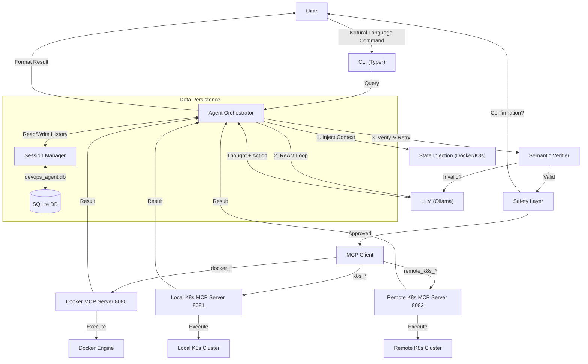

# DevOps Agent


An AI-powered DevOps assistant that understands natural language commands. Control Docker containers, local Kubernetes clusters, and remote Kubernetes clusters using plain English. Built with local LLMs via [Ollama](https://ollama.com/) for privacy, using the Model Context Protocol (MCP) for extensibility.

## Table of Contents

- [Features](#features)
- [Prerequisites](#prerequisites)
- [Installation](#installation)
- [Usage](#usage)
- [Session Management](#session-management)
- [Available Commands](#available-commands)
- [Safety Features](#safety-features)
- [Project Structure](#project-structure)
- [Troubleshooting](#troubleshooting)
- [License](#license)

## Features

- **Natural Language Processing:** Control Docker using plain English (e.g., "Start nginx on port 8080").
- **Local LLM:** Uses Ollama for privacy and offline capability. No external API calls for inference.
- **🧠 AI-Powered (DSPy)**: Uses `dspy` and `llama3.2` for intelligent tool selection and reasoning.
- **🛡️ Safe**: Includes a confirmation prompt for dangerous actions (e.g., stopping containers).
- **🔌 Extensible (MCP)**: Built on the Model Context Protocol, allowing easy addition of new tools.
- **🐳 Docker & K8s**: Supports Docker, Local Kubernetes, and Remote Kubernetes clusters.
- **💾 Persistent**: Saves conversation history to a local SQLite database.
- **Docker SDK:** Safe, programmatic interaction with Docker using the official Python SDK, avoiding raw shell command injection.
- **Remote K8s Management:** Comprehensive management of remote Kubernetes clusters (Pods, Nodes, Deployments, Namespaces).
- **Command Chaining:** Execute multiple actions in a single query (e.g., "Start nginx and list pods").
- **Parallel Execution:** Independent tools are executed in parallel for faster performance.
- **Remote Ollama Support:** Connect to powerful remote LLMs (e.g., on HPC or cloud) while keeping the agent local. "Hot-swap" models instantly.
- **Interactive Chat Mode:** Permanent REPL session with context memory (`devops-agent chat`).
- **Reliability Engine:**
    - **Fast/Smart Modes:** Automatically switches between "Fast Mode" (Zero-Shot) for simple queries and "Smart Mode" (Chain-of-Thought) for complex reasoning.
    - **ReAct Prompting:** Agent "thinks" before acting to improve intent detection.
    - **Self-Correction:** Validates tool calls and auto-retries if the LLM hallucinates arguments.
    - **Live Context:** Injects real-time cluster state (running pods/containers) into the prompt to prevent "hallucinated resource" errors.
- **Advanced Inspection:** Comprehensive `describe` tools for Remote K8s (Pods, Services, Namespaces, Nodes) with event logs and status details.
- **Auto-Proxy Config:** Automatically bypasses `NO_PROXY` settings for localhost to prevent connectivity issues in corporate environments.
- **Mix-and-Match Hosts:** Flexible configuration allows Primary (Smart) and Fast models to run on ANY combination of Local or Remote hosts.
- **In-App Model Downloading:** Directly pull missing models via the CLI wizard without leaving the agent.
- **Enhanced Debugging:** "Raw API Error" reporting reveals the exact JSON response from Kubernetes for easier troubleshooting (e.g., distinguishing 403 vs 404).

## Architecture



## Prerequisites

- **Python 3.9 or higher:** Required for the project's dependencies.
- **Docker Engine:** Must be installed and running on your machine.
- **Ollama:** Must be installed to run local LLMs. Download from [https://ollama.com/](https://ollama.com/).
- **`llama3.2` Model:** The system is configured to use the `llama3.2` model by default (3B parameters, optimized for edge).
- **Kubernetes Cluster (Optional):** For local K8s commands, you need a cluster (e.g., Docker Desktop, Minikube) and `kubectl` in your PATH. The system automatically handles `kubectl proxy`.
- **Remote K8s Access (Optional):** For remote K8s commands, you need access to the remote cluster.

## Installation

1.  **Clone the Repository:**
    ```bash
    git clone <your-repository-url>
    cd devops-agent
    ```

2.  **Create and Activate a Virtual Environment:**
    ```bash
    # Create the virtual environment
    python -m venv .venv

    # Activate it on Windows (Command Prompt)
    .\.venv\Scripts\activate

    # OR activate it on Windows (PowerShell)
    .\.venv\Scripts\Activate.ps1

    # OR activate it on macOS/Linux
    source .venv/bin/activate
    ```

3.  **Install Python Dependencies:**
    ```bash
    pip install -r requirements.txt
    # OR install the package in development mode (recommended)
    pip install -e .
    ```

## Usage

The system requires two main components to be running simultaneously: the Ollama service (providing the LLM) and the DevOps Agent MCP servers.

### Step 1: Start Ollama Service

Open a **new terminal** window/tab.

1.  Navigate to the project directory and activate the virtual environment.
2.  Start the Ollama service:
    ```bash
    ollama serve
    ```
    *Note: The system automatically configures `NO_PROXY` for localhost, so you don't need to manually bypass corporate proxies for local connections.*

### Step 2: Start MCP Servers (Interactive Setup)

Open **another new terminal** window/tab.

1.  Navigate to the project directory and activate the virtual environment.
2.  Run the start command:
    ```bash
    devops-agent start-all
    ```
3.  **Follow the Streamlined Wizard:**
    - **🤖 Smart Model Setup:** Select **Host** (Local/Remote) and **Model**.
    - **⚡ Fast Model Setup:** Choose to reuse the Smart configuration or pick a different Host/Model for speed (e.g., Local Fast Model + Remote Smart Model).
    - **[+] Download Models:** If a model isn't listed, select `[+] Download/Pull New Model` to fetch it instantly.
    - **Summary:** Review your final configuration before servers launch.

    This will launch 3 separate processes in new windows:
    - Docker MCP Server (Port 8080)
    - Local K8s MCP Server (Port 8081)
    - Remote K8s MCP Server (Port 8082)

    *Alternatively, you can start them individually:*
    ```bash
    devops-agent server --port 8080
    devops-agent k8s-server --port 8081
    devops-agent remote-k8s-server --port 8082
    ```

### Step 3: Run Commands

Open **a third terminal** window/tab for running your commands.

1.  Navigate to the project directory and activate the virtual environment.
2.  Use natural language to control Docker and Kubernetes:

    **Docker Commands:**
    ```bash
    devops-agent run "List all containers"
    devops-agent run "Start nginx on port 8080"
    ```

    **Local Kubernetes Commands:**
    ```bash
    devops-agent run "Show me the running nodes in my local machine"
    devops-agent run "List pods in default namespace"
    ```

    **Remote Kubernetes Commands:**
    ```bash
    devops-agent run "Show me the running nodes in remote cluster"
    devops-agent run "List pods in remote cluster"
    # New Describe Capabilities:
    devops-agent run "Describe pod n8n-workflow-123"
    devops-agent run "Describe namespace kube-system"
    devops-agent run "Describe service my-service"
    ```

    **Interactive Chat Mode:**
    ```bash
    devops-agent chat
    # Type your queries, use /model to switch models, or exit to quit.
    ```

## Session Management

The tool supports conversation sessions, allowing you to maintain context across multiple commands.

**Start a Session:**
```bash
devops-agent session start "Debugging Nginx"
# Output: Session started with ID: <session_id>
```

**Run Commands in Session:**
Once a session is started, all `run` commands automatically use it.
```bash
devops-agent run "Describe the first pod"  # Uses context from previous command
```

**Manage Sessions:**
```bash
devops-agent session list   # List all sessions
devops-agent session show <id>  # Show history of a session
devops-agent session end    # End the current active session
devops-agent session clear  # Clear all history
```

**Interactive Chat Mode (REPL)**

Instead of running single commands, you can enter an interactive chat mode:
```bash
devops-agent chat
```

**Features:**
- **Persistent Session:** Remembers previous commands and outputs.
- **Session Management:**
  ```bash
  devops-agent chat --session "Debug Nginx"      # Create named session
  devops-agent chat --session-resume <id>        # Resume specific session
  ```
- **Hot Swap:** Switch models (Local vs. Remote) instantly inside the chat using `/model`.

## Configuration
 
The default LLM model is `llama3.2`. You can change this by modifying `devops_agent/settings.py` or setting the `DEVOPS_LLM_MODEL` environment variable.

### Remote Ollama (HPC / Cloud)
You can connect to a remote Ollama instance (e.g., a powerful GPU server) instead of running strictly locally.
1. Run `devops-agent start-all`.
2. Select **[2] Remote / HPC** in the wizard.
3. Enter the URL (e.g., `http://192.168.1.50:11434`).
4. Select a model from the *remote* server.
The CLI will visually indicate the context: `[Remote: llama3.1:70b]`.

## Available Commands

### Core CLI Commands

- `devops-agent start-all`: **Recommended.** Starts all 3 MCP servers (Docker, Local K8s, Remote K8s) in separate processes.
- `devops-agent run "<query>"`: Executes a command based on the natural language query.
- `devops-agent session`: Access session management subcommands (`start`, `end`, `list`, `show`, `clear`).
- `devops-agent status`: Checks the status of the LLM connection, MCP servers, and available tools.
- `devops-agent list-tools`: Lists all available tools.

### Server Commands (for manual control)

- `devops-agent server`: Starts the Docker MCP server (default port 8080).
- `devops-agent k8s-server`: Starts the Local Kubernetes MCP server (default port 8081).
- `devops-agent remote-k8s-server`: Starts the Remote Kubernetes MCP server (default port 8082).

### Natural Language Examples

- **Docker:** `"Start nginx"`, `"Stop container my-nginx"`, `"List containers"`
- **Local K8s:** `"List local nodes"`, `"Show pods in kube-system"`
- **Remote K8s:** 
    - `"List remote nodes"`
    - `"Describe node kc-worker-1 in remote cluster"`
    - `"List deployments in default namespace in remote k8s"`
    - `"Describe deployment my-dep in remote k8s"`
    - `"Find which namespace pod 'my-app' is in"`
    - `"Get IPs for pod 'my-app'"`
    - `"List all remote services"`
    - `"List remote services in default namespace"`
    - `"Get service n8n-service"`
- **Command Chaining:** `"Start nginx and list all containers"`, `"List local pods and then list remote pods"`

### Options for `run` Command

- `query`: The natural language command (e.g., "Start an nginx container").
- `--verbose` / `-v`: Show detailed logs of the agent's decision-making process.
- `--no-confirm` / `-y`: Skip safety confirmation prompts (use with caution).
- `--session` / `-s`: Resume a specific conversation session ID.
- `--check-llm`: Force a connectivity test for the LLM before running (slower, but verifies model access). Default behavior skips this for speed.

## Safety Features

- **Confirmation Prompts:** Destructive operations prompt for confirmation.
- **Input Validation:** Arguments are validated using Pydantic models.
- **Safe Execution:** Uses official SDKs where possible.

## Project Structure

```
devops-agent/
├── devops_agent/             # Main Python package
│   ├── __init__.py
│   ├── cli.py                # Command-Line Interface (Typer)
│   ├── cli_helper.py         # CLI Wizard & TUI helpers
│   ├── agent.py              # Orchestrates LLM, tools, safety
│   ├── agent_module.py       # DSPy Agent definition
│   ├── dspy_client.py        # DSPy Integration
│   ├── safety.py             # Confirmation logic
│   ├── settings.py           # Configuration management
│   ├── database/             # Database layer
│   │   ├── __init__.py
│   │   ├── devops_agent.db   # SQLite database file (auto-created)
│   │   ├── db.py             # SQL repository and schema
│   │   └── session_manager.py # Manages conversation history/context
│   ├── mcp/                  # Model Context Protocol components
│   │   ├── server.py         # Docker MCP server
│   │   ├── k8s_server.py     # Local K8s MCP server
│   │   ├── remote_k8s_server.py # Remote K8s MCP server
│   │   └── client.py         # MCP client with routing logic
│   ├── tools/                # Docker tool definitions
│   ├── k8s_tools/            # Kubernetes tool definitions
│   └── llm/                  # LLM interaction components
├── requirements.txt          # Python dependencies
├── pyproject.toml            # Package build configuration
└── README.md                 # This file
```

## Troubleshooting

- **"Cannot connect to MCP server..."**: Ensure you have run `devops-agent start-all` or the specific server command.
- **"LLM not available..."**: Ensure `ollama serve` is running.
- **"UnicodeEncodeError"**: On Windows, you might see emoji encoding errors in some terminals. Try using a terminal that supports UTF-8 (like Windows Terminal) or set `PYTHONIOENCODING=utf-8`.
